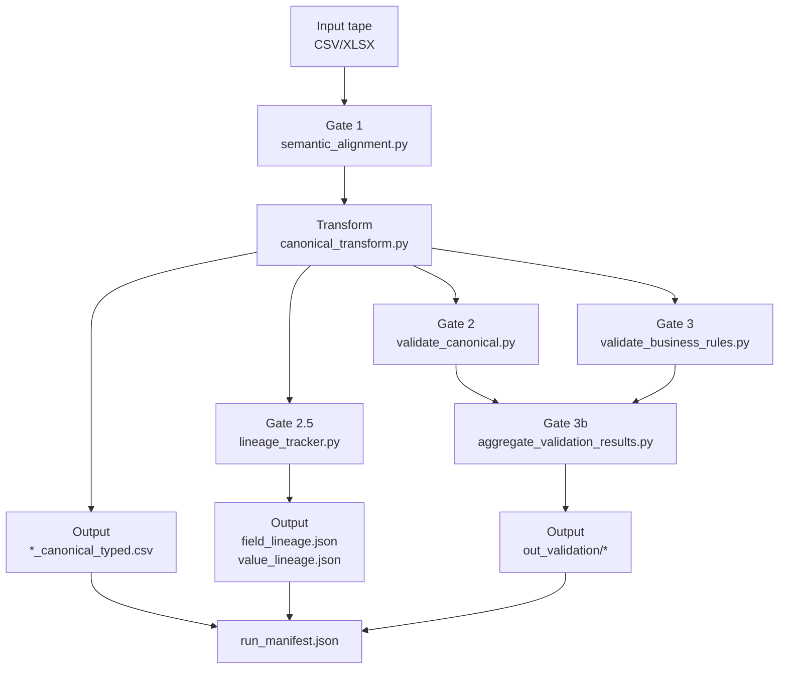
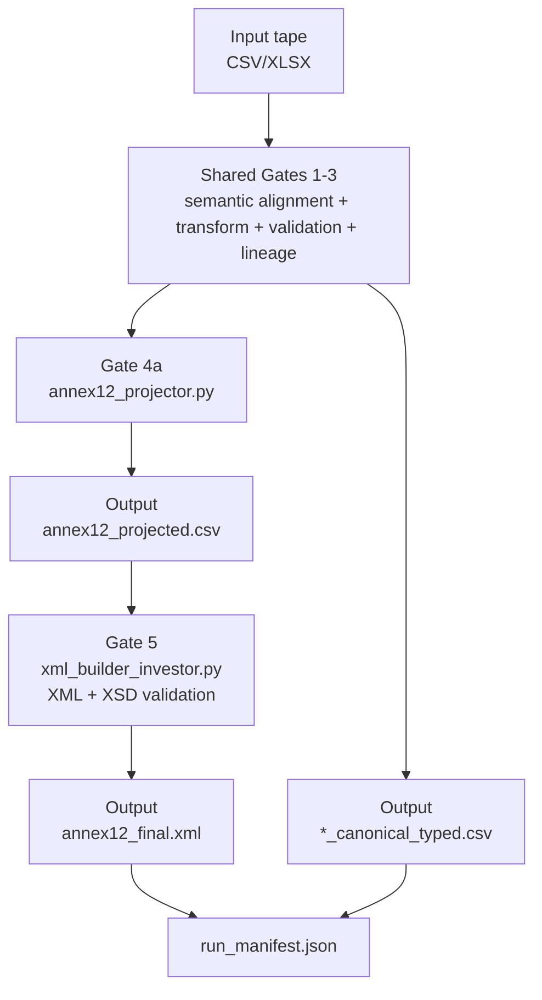
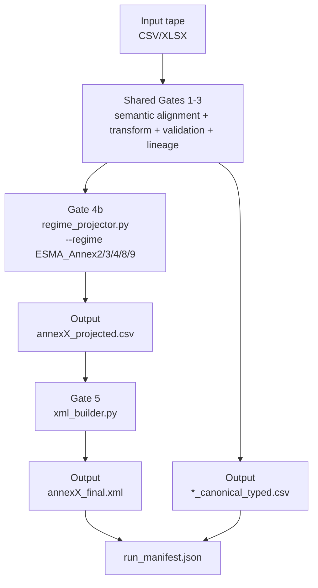

# Trakt

Data pipeline and analytics platform for Equity Release Mortgage (ERM) portfolio management with ESMA Annex 12 regulatory compliance.

Trakt ingests raw loan tape data, normalises it into a canonical format, validates it against schema and business rules, and produces regime-specific outputs for MI dashboards, ESMA Annex 12 investor reporting, or Annex 2-9 regulatory submissions.

## Quick start

```bash
pip install -r requirements.txt

# MI mode — produce dashboard-ready canonical for Streamlit
python engine/orchestrator/trakt_run.py \
  --mode mi \
  --input loan_portfolio_112025.csv

# Annex 12 — investor reporting (deal-level XML)
python engine/orchestrator/trakt_run.py \
  --mode annex12 \
  --input loan_portfolio_112025.csv \
  --config config/client/config_client_annex12.yaml

# Regulatory — exposure-level Annex 2-9
python engine/orchestrator/trakt_run.py \
  --mode regulatory \
  --input loan_portfolio_112025.csv \
  --regime ESMA_Annex2

# Launch the analytics dashboard
streamlit run analytics/streamlit_app_erm.py
```

## Pipeline modes

`trakt_run.py` supports three modes. Gates 1-3 are common to all modes; Gates 4-5 are mode-specific.

| Mode | Gates | Output |
|------|-------|--------|
| `mi` | 1-3 | `canonical_typed.csv` for Streamlit dashboard |
| `annex12` | 1-5 | ESMA Annex 12 investor XML (deal-level) |
| `regulatory` | 1-5 | ESMA Annex 2-9 regime projection + XML (exposure-level) |

### Gate sequence

| Gate | Script | Purpose |
|------|--------|---------|
| 1 - Semantic alignment | `semantic_alignment.py` | Fuzzy-matches raw loan tape columns to the canonical field registry |
| &mdash; Transform | `canonical_transform.py` | Standardises formats, enriches geography (NUTS/ITL), derives fields (LTV, classifications) |
| 2 - Canonical validation | `validate_canonical.py` | Schema and format validation against the field registry |
| 2.5 - Lineage | `lineage_tracker.py` | Tracks field-level and value-level data lineage |
| 3 - Business rules | `validate_business_rules.py` | Cross-field business rule validation |
| 4a - Annex 12 projection | `annex12_projector.py` | Projects canonical data into the ESMA Annex 12 schema (annex12 mode) |
| 4b - Regime projection | `regime_projector.py` | Projects canonical data into ESMA Annex 2-9 schemas (regulatory mode) |
| 5 - XML + XSD validation | `xml_builder_investor.py` | Generates ESMA-compliant XML and validates against the XSD schema |

A JSON run manifest (`out/run_manifest.json`) is produced at the end of every run with gate statuses, artefact paths, and timing.

## Runtime architecture diagrams

The runtime below is based on `engine/orchestrator/trakt_run.py`: Gates 1-3 are shared, then the pipeline branches by mode.

### 1) MI mode runtime (Gates 1-3)



### 2) Annex 12 runtime (Gates 1-5)



### 3) Annex 2-9 runtime (Regulatory mode, Gates 1-5)



## Blob storage trigger

`function_app.py` (Azure Event Grid trigger) provides automatic pipeline execution when a CSV is uploaded to the `inbound` container of the Azure Blob Storage account. The trigger downloads the file, runs `trakt_run.py` as a subprocess, then uploads all outputs to the `outbound` container.

Upload path convention determines the pipeline mode:
```
inbound/tape.csv                  → MI mode (default)
inbound/mi/tape.csv               → MI mode (explicit folder)
inbound/annex12/tape.csv          → Annex 12 mode
inbound/tape_annex12.csv          → Annex 12 mode (filename hint)
inbound/regulatory/tape.csv       → Regulatory mode
inbound/tape_regulatory.csv       → Regulatory mode (filename hint)
```

Outputs are written back to blob storage under:
```
outbound/{mode}/{stem}/out/               → canonical CSV, XML, manifest
outbound/{mode}/{stem}/out_validation/    → validation reports
```

Required app settings:
```
DATA_STORAGE_CONNECTION   → Azure Storage connection string
TRAKT_ANNEX12_CONFIG      → path to annex12 config YAML (annex12 mode)
TRAKT_REGIME              → target regime e.g. ESMA_Annex2 (regulatory mode)
```

## Analytics dashboard

`streamlit_app_erm.py` provides an interactive dashboard with three tabs:

- **Stratifications** -- portfolio breakdowns by LTV, region, ticket size, interest rate, borrower age, and origination vintage.
- **Scenario Analysis** -- cashflow projections under configurable HPI, prepayment, mortality, and interest rate assumptions (requires `scenario_engine` module).
- **Static Pools** -- cohort-based performance tracking with prepayment and risk segmentation.

Optional modules (`risk_monitor.py`, `risk_limits_config.py`) add concentration-limit monitoring when present.

## LLM agent (Tier 7 field mapper)

When raw loan tape headers cannot be resolved by the deterministic tiers (Tiers 1-6 in `semantic_alignment.py`), `agent_orchestrator.py` invokes `llm_mapper_agent.py` to call Claude Sonnet for a suggestion. **Human confirmation is mandatory before any mapping is applied.** Confirmed mappings are written to `aliases_llm_confirmed.yaml` so future runs resolve at Tier 3 (alias lookup) with no LLM involvement.

```bash
# Run the agent on a tape that has unmapped headers
python engine/gate_1_alignment/agent_orchestrator.py \
  --input loan_portfolio_112025.csv \
  --portfolio-type equity_release \
  --registry config/system/fields_registry.yaml \
  --aliases-dir engine/gate_1_alignment/aliases \
  --config config/system/config_agent.yaml \
  --mode cli \
  --output-dir out
```

Pipeline steps inside the agent orchestrator:

1. **Deterministic pass** — runs `semantic_alignment.py` (Tiers 1-6: exact, normalised, alias, token-set Jaccard, RapidFuzz)
2. **LLM targets** — collects headers still `unmapped` or with confidence below `review_threshold` (default 0.92)
3. **LLM suggestions** — batches headers (up to 10 per call) with sample values and column stats to Claude Sonnet; nulls any hallucinated field names not in the registry
4. **Auto-approve** — optionally accepts high-confidence suggestions above `auto_approve_threshold` without human input (off by default for regulatory safety)
5. **Human review** — presents each suggestion via CLI or Streamlit UI (Confirm / Remap / Skip / Quit)
6. **Alias learning** — persists confirmed mappings to `aliases_llm_confirmed.yaml`; deduplicates across all alias files
7. **Second deterministic pass** — re-runs `semantic_alignment.py` with the augmented aliases
8. **Governance artifact** — writes a versioned JSON session record to `governance/agent_sessions/`

The agent is a pre-processing step, not part of the automated blob trigger pipeline. Run it interactively when a new lender's tape format is encountered; once aliases are confirmed, all subsequent automated runs resolve deterministically.

Key agent configuration (`config/system/config_agent.yaml`):

| Setting | Default | Purpose |
|---------|---------|---------|
| `model` | `claude-sonnet-4-20250514` | Claude model used for suggestions |
| `temperature` | `0.0` | Deterministic output |
| `review_threshold` | `0.92` | Confidence floor; below this triggers LLM |
| `auto_approve_threshold` | `null` | Auto-approve above this (requires `--enable-auto-approve`) |
| `max_batch_size` | `10` | Headers per API call |
| `max_api_calls_per_session` | `10` | Budget cap |

## Configuration

| File | Role |
|------|------|
| `config/client/config_client_ERM_UK.yaml` | Master client config — identity, transformations, enrichment rules, UI branding |
| `config/client/config_client_annex12.yaml` | ESMA Annex 12 deal metadata and structural overlay |
| `config/system/fields_registry.yaml` | Canonical field definitions (200+ fields, all portfolio types) |
| `config/system/config_agent.yaml` | LLM Tier 7 agent settings (model, thresholds, budget caps) |
| `config/regime/annex12_field_constraints.yaml` | Field-level validation constraints |
| `config/regime/annex12_rules.yaml` | Business rule definitions |
| `config/asset/product_defaults_ERM.yaml` | Default values for equity release mortgage fields |
| `config/system/aliases_*.yaml` | Field alias mappings for deterministic header matching |

## Key outputs

| Artefact | Description |
|----------|-------------|
| `*_canonical_full.csv` | Mapped canonical output (pre-typing) |
| `*_canonical_typed.csv` | Typed and enriched canonical output |
| `annex12_projected.csv` | Full Annex 12 record set |
| `annex12_final.xml` | ESMA-compliant investor XML report |
| `out/run_manifest.json` | Pipeline run manifest with gate results |
| `out/field_lineage.json` | Field-level data lineage |

## Project structure

```
trakt/
  function_app.py                    # Azure Event Grid trigger (blob upload → pipeline)
  engine/
    orchestrator/
      trakt_run.py                   # Pipeline orchestrator (entry point)
    gate_1_alignment/
      semantic_alignment.py          # Gate 1: deterministic semantic alignment (Tiers 1-6)
      agent_orchestrator.py          # LLM Tier 7 orchestrator (human-in-the-loop)
      llm_mapper_agent.py            # LLM field mapper, human review, alias learner
      aliases/
        alias_builder.py             # TF-IDF alias generation
      prompts/
        field_mapper_system.txt      # Claude system prompt for field mapping
    gate_2_transform/
      canonical_transform.py         # Transform: typing & derivation
      lineage_tracker.py             # Gate 2.5: data lineage
      delta_manifest.py              # Run manifest / SHA256 hashing
    gate_3_validation/
      validate_canonical.py          # Gate 2: canonical validation
      validate_business_rules.py     # Gate 3: business rule validation
      aggregate_validation_results.py # Gate 3b: validation results aggregation
    gate_4_projection/
      annex12_projector.py           # Gate 4a: Annex 12 projection
      regime_projector.py            # Gate 4b: Annex 2-9 regime projector
    gate_5_delivery/
      xml_builder_investor.py        # Gate 5: ESMA XML generation + XSD validation
      xml_builder.py                 # Gate 5: Jinja2-based XML builder (regulatory)
  analytics/
    streamlit_app_erm.py             # Analytics dashboard (entry point)
    mi_prep.py                       # Dashboard data preparation layer
    blob_storage.py                  # Azure Blob integration for dashboard data
    charts_plotly.py                 # Plotly chart factories
    scenario_engine.py               # Cashflow projection engine
    static_pools_core.py             # Static pool analysis engine
    risk_monitor.py                  # Concentration-limit monitoring
  config/
    system/
      fields_registry.yaml           # Canonical field definitions (200+ fields)
      config_agent.yaml              # LLM agent configuration
      aliases_mandatory.yaml         # Mandatory field aliases
      aliases_optional.yaml          # Optional field aliases
      aliases_analytics.yaml         # Analytics-specific aliases
    client/
      config_client_ERM_UK.yaml      # Master client configuration
      config_client_annex12.yaml     # ESMA Annex 12 configuration
    asset/                           # Product defaults and policies
    regime/                          # Regulatory regime configurations
  requirements.txt                   # Python dependencies
```
