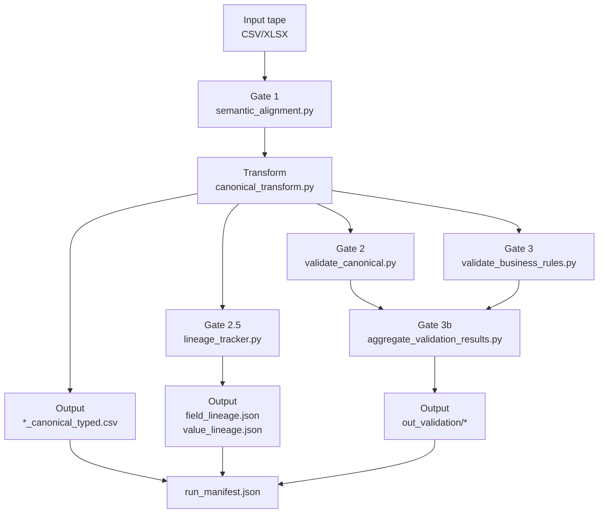
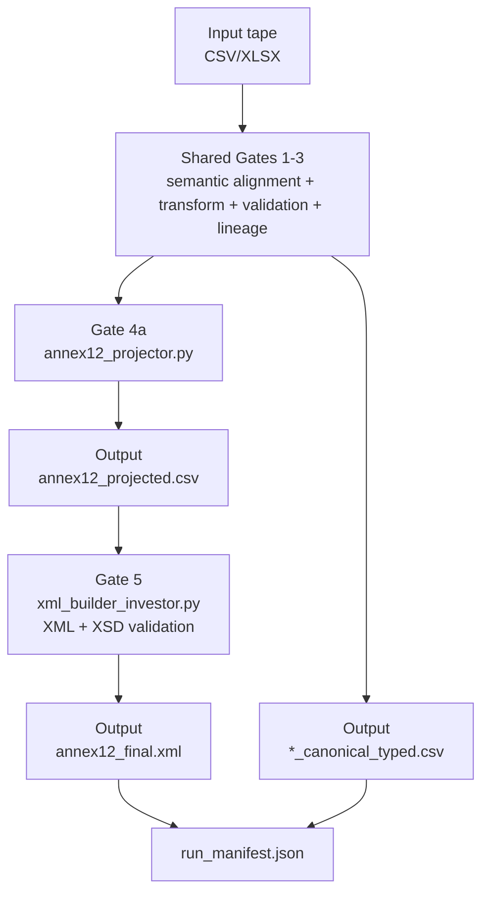
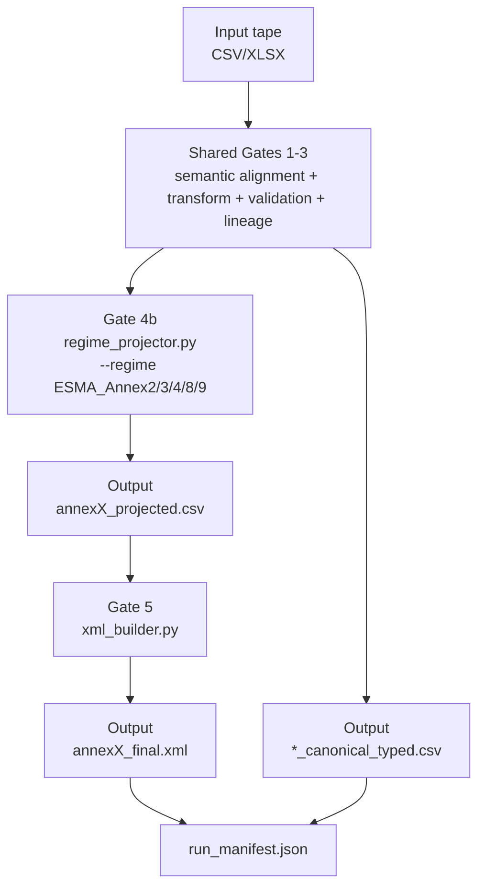

# Trakt

Data pipeline and analytics platform for Equity Release Mortgage (ERM) portfolio management with ESMA Annex 12 regulatory compliance.

Trakt ingests raw loan tape data, normalises it into a canonical format, validates it against schema and business rules, and produces regime-specific outputs for MI dashboards, ESMA Annex 12 investor reporting, or Annex 2-9 regulatory submissions.

## Quick start

```bash
pip install -r requirements.txt

# MI mode — produce dashboard-ready canonical for Streamlit
python engine/orchestrator/trakt_run.py \
  --mode mi \
  --input loan_portfolio_112025.csv

# Annex 12 — investor reporting (deal-level XML)
python engine/orchestrator/trakt_run.py \
  --mode annex12 \
  --input loan_portfolio_112025.csv \
  --config config/client/config_client_annex12.yaml

# Regulatory — exposure-level Annex 2-9
python engine/orchestrator/trakt_run.py \
  --mode regulatory \
  --input loan_portfolio_112025.csv \
  --regime ESMA_Annex2

# Launch the analytics dashboard
streamlit run analytics/streamlit_app_erm.py
```

## Pipeline modes

`trakt_run.py` supports three modes. Gates 1-3 are common to all modes; Gates 4-5 are mode-specific.

| Mode | Gates | Output |
|------|-------|--------|
| `mi` | 1-3 | `canonical_typed.csv` for Streamlit dashboard |
| `annex12` | 1-5 | ESMA Annex 12 investor XML (deal-level) |
| `regulatory` | 1-5 | ESMA Annex 2-9 regime projection + XML (exposure-level) |

### Gate sequence

| Gate | Script | Purpose |
|------|--------|---------|
| 1 - Semantic alignment | `semantic_alignment.py` | Fuzzy-matches raw loan tape columns to the canonical field registry |
| &mdash; Transform | `canonical_transform.py` | Standardises formats, enriches geography (NUTS/ITL), derives fields (LTV, classifications) |
| 2 - Canonical validation | `validate_canonical.py` | Schema and format validation against the field registry |
| 2.5 - Lineage | `lineage_tracker.py` | Tracks field-level and value-level data lineage |
| 3 - Business rules | `validate_business_rules.py` | Cross-field business rule validation |
| 4a - Annex 12 projection | `annex12_projector.py` | Projects canonical data into the ESMA Annex 12 schema (annex12 mode) |
| 4b - Regime projection | `regime_projector.py` | Projects canonical data into ESMA Annex 2-9 schemas (regulatory mode) |
| 5 - XML + XSD validation | `xml_builder_investor.py` | Generates ESMA-compliant XML and validates against the XSD schema |

A JSON run manifest (`out/run_manifest.json`) is produced at the end of every run with gate statuses, artefact paths, and timing.

## Runtime architecture diagrams

The runtime below is based on `engine/orchestrator/trakt_run.py`: Gates 1-3 are shared, then the pipeline branches by mode.

### 1) MI mode runtime (Gates 1-3)


```mermaid
flowchart TD
    A[Input tape\nCSV/XLSX] --> B[Gate 1\nsemantic_alignment.py]
    B --> C[Transform\ncanonical_transform.py]
    C --> D[Gate 2\nvalidate_canonical.py]
    C --> E[Gate 2.5\nlineage_tracker.py]
    C --> F[Gate 3\nvalidate_business_rules.py]
    D --> G[Gate 3b\naggregate_validation_results.py]
    F --> G
    C --> H[Output\n*_canonical_typed.csv]
    E --> I[Output\nfield_lineage.json\nvalue_lineage.json]
    G --> J[Output\nout_validation/*]
    H --> K[run_manifest.json]
    I --> K
    J --> K
```

### 2) Annex 12 runtime (Gates 1-5)


```mermaid
flowchart TD
    A[Input tape\nCSV/XLSX] --> B[Shared Gates 1-3\nsemantic alignment + transform + validation + lineage]
    B --> C[Gate 4a\nannex12_projector.py]
    C --> D[Output\nannex12_projected.csv]
    D --> E[Gate 5\nxml_builder_investor.py\nXML + XSD validation]
    E --> F[Output\nannex12_final.xml]
    B --> G[Output\n*_canonical_typed.csv]
    F --> H[run_manifest.json]
    G --> H
```

### 3) Annex 2-9 runtime (Regulatory mode, Gates 1-5)


```mermaid
flowchart TD
    A[Input tape\nCSV/XLSX] --> B[Shared Gates 1-3\nsemantic alignment + transform + validation + lineage]
    B --> C[Gate 4b\nregime_projector.py\n--regime ESMA_Annex2/3/4/8/9]
    C --> D[Output\nannexX_projected.csv]
    D --> E[Gate 5\nxml_builder.py]
    E --> F[Output\nannexX_final.xml]
    B --> G[Output\n*_canonical_typed.csv]
    F --> H[run_manifest.json]
    G --> H
```

## Blob storage trigger

`function_app.py` (Azure Event Grid trigger) provides automatic pipeline execution when a CSV is uploaded to the `inbound` container of the Azure Blob Storage account. The trigger downloads the file, runs `trakt_run.py` as a subprocess, then uploads all outputs to the `outbound` container.

Upload path convention determines the pipeline mode:
```
inbound/tape.csv                  → MI mode (default)
inbound/mi/tape.csv               → MI mode (explicit folder)
inbound/annex12/tape.csv          → Annex 12 mode
inbound/tape_annex12.csv          → Annex 12 mode (filename hint)
inbound/regulatory/tape.csv       → Regulatory mode
inbound/tape_regulatory.csv       → Regulatory mode (filename hint)
```

Outputs are written back to blob storage under:
```
outbound/{mode}/{stem}/out/               → canonical CSV, XML, manifest
outbound/{mode}/{stem}/out_validation/    → validation reports
```

Required app settings:
```
DATA_STORAGE_CONNECTION   → Azure Storage connection string
TRAKT_ANNEX12_CONFIG      → path to annex12 config YAML (annex12 mode)
TRAKT_REGIME              → target regime e.g. ESMA_Annex2 (regulatory mode)
FUNCTIONS_WORKER_RUNTIME  → python
```

Flex Consumption note:
- For this Function App plan, runtime is configured via `functionAppConfig.runtime`.
- Do **not** set `FUNCTIONS_WORKER_RUNTIME`, `SCM_DO_BUILD_DURING_DEPLOYMENT`, or `ENABLE_ORYX_BUILD` as app settings for Flex Consumption deployments.

Pipeline snapshot ingestion settings (optional; defaults shown):
```
TRAKT_PIPELINE_INBOUND_PREFIX        → pipeline/
TRAKT_PIPELINE_SNAPSHOT_PREFIX       → mi/pipeline_snapshots/
TRAKT_PIPELINE_SNAPSHOT_POINTER_BLOB → mi/pipeline_snapshots/latest_pipeline_snapshot.json
```

Weekly pipeline snapshot flow:
1. Upload weekly pipeline CSVs into `inbound/pipeline/`.
2. Event Grid trigger validates readability + extension, then copies snapshot to:
   `outbound/mi/pipeline_snapshots/<filename>_<etag12>.csv`.
3. Trigger updates the latest pointer blob:
   `outbound/mi/pipeline_snapshots/latest_pipeline_snapshot.json`.
4. Streamlit Pipeline tab auto-detects/selects these blobs (newest first) and no longer requires a local pipeline CSV path input.

## Analytics dashboard

`streamlit_app_erm.py` provides an interactive dashboard with core tabs and optional extensions:

- **Stratifications** -- portfolio breakdowns by LTV, region, ticket size, interest rate, borrower age, and origination vintage.
- **Scenario Analysis** -- cashflow projections under configurable HPI, prepayment, mortality, and interest rate assumptions (requires `scenario_engine` module).
- **Static Pools** -- cohort-based performance tracking with prepayment and risk segmentation.
- **Pipeline** *(optional module)* -- pipeline snapshot MI only: snapshot status/metadata, stage funnel, completed-vs-funded reconciliation control, and pipeline composition stratifications.
- **Forward Exposure** *(optional module)* -- assumption-driven planning layer combining funded current exposure with expected pipeline funding (expected funding outputs + forward concentration).

Optional modules (`risk_monitor.py`, `risk_limits_config.py`) add concentration-limit monitoring when present.

Expected-funding config resolution:
- Default config is `config/client/pipeline_expected_funding.yaml`.
- Runtime resolves config path robustly from:
  1) absolute path, then
  2) current working directory relative path, then
  3) repository/module-relative path.
- This avoids container working-directory drift in Azure deployments.


### Synthetic pipeline MI demo

Run an end-to-end synthetic validation (funded + pipeline + reconciliation + expected funding + forward exposure persistence):

```bash
python scripts/run_pipeline_mi_demo.py
```

Inputs used by default:
- funded: `synthetic_demo/output/SYNTHETIC_ERE_Portfolio_012026_canonical_typed.csv`
- pipeline: `demo/synthetic_pipeline_input.csv`
- expected funding config: `config/client/pipeline_expected_funding.yaml`

Outputs written by default:
- `out_pipeline_demo/forward_exposure_latest.csv`
- `out_pipeline_demo/forward_exposure_latest.json`
- `out_pipeline_demo/latest_forward_exposure_path.txt`

Add `--upload-to-blob` to attempt upload via existing Azure blob configuration.

## LLM agent (Tier 7 field mapper)

When raw loan tape headers cannot be resolved by the deterministic tiers (Tiers 1-6 in `semantic_alignment.py`), `agent_orchestrator.py` invokes `llm_mapper_agent.py` to call Claude Sonnet for a suggestion. **Human confirmation is mandatory before any mapping is applied.** Confirmed mappings are written to `aliases_llm_confirmed.yaml` so future runs resolve at Tier 3 (alias lookup) with no LLM involvement.

```bash
# Run the agent on a tape that has unmapped headers
python engine/gate_1_alignment/agent_orchestrator.py \
  --input loan_portfolio_112025.csv \
  --portfolio-type equity_release \
  --registry config/system/fields_registry.yaml \
  --aliases-dir engine/gate_1_alignment/aliases \
  --config config/system/config_agent.yaml \
  --mode cli \
  --output-dir out
```

Pipeline steps inside the agent orchestrator:

1. **Deterministic pass** — runs `semantic_alignment.py` (Tiers 1-6: exact, normalised, alias, token-set Jaccard, RapidFuzz)
2. **LLM targets** — collects headers still `unmapped` or with confidence below `review_threshold` (default 0.92)
3. **LLM suggestions** — batches headers (up to 10 per call) with sample values and column stats to Claude Sonnet; nulls any hallucinated field names not in the registry
4. **Auto-approve** — optionally accepts high-confidence suggestions above `auto_approve_threshold` without human input (off by default for regulatory safety)
5. **Human review** — presents each suggestion via CLI or Streamlit UI (Confirm / Remap / Skip / Quit)
6. **Alias learning** — persists confirmed mappings to `aliases_llm_confirmed.yaml`; deduplicates across all alias files
7. **Second deterministic pass** — re-runs `semantic_alignment.py` with the augmented aliases
8. **Governance artifact** — writes a versioned JSON session record to `governance/agent_sessions/`

The agent is a pre-processing step, not part of the automated blob trigger pipeline. Run it interactively when a new lender's tape format is encountered; once aliases are confirmed, all subsequent automated runs resolve deterministically.

Key agent configuration (`config/system/config_agent.yaml`):

| Setting | Default | Purpose |
|---------|---------|---------|
| `model` | `claude-sonnet-4-20250514` | Claude model used for suggestions |
| `temperature` | `0.0` | Deterministic output |
| `review_threshold` | `0.92` | Confidence floor; below this triggers LLM |
| `auto_approve_threshold` | `null` | Auto-approve above this (requires `--enable-auto-approve`) |
| `max_batch_size` | `10` | Headers per API call |
| `max_api_calls_per_session` | `10` | Budget cap |

## Source-portfolio provenance

For securitisation readiness every loan carries a **source-cohort tag** so
management, the IB, legal counsel and rating agencies can split direct
originations from acquired back books. Provenance is supplied once, at
onboarding, as run-level metadata and is stamped onto **every loan row** before
canonical creation — it then survives canonical transformation, regime
projection and MI querying. The single source of truth is
[`engine/provenance.py`](engine/provenance.py).

### Fields (canonical)

| Field | Meaning |
|-------|---------|
| `source_portfolio_id` | Stable source-cohort id, **mandatory** on every row (e.g. `direct_001`, `acquired_001`, `acquired_002`). |
| `source_portfolio_type` | `direct` or `acquired`. Derived from the id prefix when not given. |
| `source_portfolio_label` | Human-readable label, e.g. `Direct Book`, `Acquired Portfolio 1`. |
| `acquisition_date` | Date an acquired portfolio was acquired; null for direct books. |
| `seller_name` | Seller/vendor of an acquired book (nullable). |
| `portfolio_cohort` | Cohort key used by MI; defaults to `source_portfolio_id`. |

> These are **analytics provenance fields**, separate from the canonical
> `portfolio_type` (which means asset class: equity_release / sme / cre …).

**Naming convention:** `direct_NNN` for directly originated books and
`acquired_NNN` for acquired portfolios (`direct_001`, `acquired_001`,
`acquired_002`, …). The `direct_`/`acquired_` prefix auto-derives
`source_portfolio_type`; any other prefix requires an explicit
`--source-portfolio-type`.

### Onboarding with provenance

The current book (direct originations):

```bash
python -m engine.onboarding_agent.cli \
  --input-dir direct_book/ \
  --client-name "ERE Funding" \
  --output-dir onboarding_output/direct_001 \
  --source-portfolio-id direct_001 \
  --source-portfolio-type direct \
  --source-portfolio-label "Direct Book"
# then: python -m engine.onboarding_agent.cli promote --project-dir onboarding_output/direct_001
```

A first acquired back book:

```bash
python -m engine.onboarding_agent.cli \
  --input-dir acquired_book_1/ \
  --client-name "ERE Funding" \
  --output-dir onboarding_output/acquired_001 \
  --source-portfolio-id acquired_001 \
  --source-portfolio-type acquired \
  --source-portfolio-label "Acquired Portfolio 1" \
  --acquisition-date 2026-08-15 \
  --seller-name "Seller A"
```

The same flags work on the live pipeline orchestrator
(`engine/orchestrator/trakt_run.py --mode mi|regulatory … --source-portfolio-id …`),
which stamps `*_canonical_typed.csv` directly.

**Fail closed:** a run with no `--source-portfolio-id` is rejected (the pipeline
never assigns `unknown`). An acquired portfolio with no `--acquisition-date`
fails unless `--allow-unknown-acquisition-date` is set. The canonical
validation gate enforces the same rules (`PROV001`–`PROV005`).

### MI Agent portfolio lenses

The MI Agent ([`mi_agent/portfolio_lens.py`](mi_agent/portfolio_lens.py))
answers through three lenses plus exact cohorts, resolved from natural language:

| Says… | Lens | Filter |
|-------|------|--------|
| "total", "whole book", "all loans" | **total** | _(none)_ |
| "direct", "originated", "current book", "organic" | **direct** | `source_portfolio_type = direct` |
| "acquired", "back book", "purchased book" | **acquired** | `source_portfolio_type = acquired` |
| `direct_001` / `acquired_001` / `acquired_002` | **cohort** | `source_portfolio_id = …` |

The selected lens is echoed in the result metadata and chart/table/card title
(e.g. *Portfolio Summary — Acquired*, *LTV Stratification — acquired_001*).
"Compare direct vs acquired" / "direct_001 vs acquired_001" resolve to
side-by-side aggregations.

### Regime outputs (ESMA Annex 2)

The official ESMA output stays **template-clean** — provenance fields have no
ESMA code and are never emitted into the regime CSV/XML. The regime projector
instead writes a **companion** (`*_<regime>_provenance.csv` +
`*_<regime>_provenance_manifest.json`) that links each regulatory row back to
`source_portfolio_id` / `source_portfolio_type` / `portfolio_cohort` and the
original loan identifier — so IB / legal / rating-agency packs retain full
traceability without contaminating the template.

## Assembler Agent

The **Assembler Agent** (`engine/assembler_agent.py`) sits between the Onboarding
Agent and the downstream MI / Regime agents. It consolidates the validated
per-portfolio canonical files into **one central consolidated canonical** and
routes it to the selected pipeline. It reads canonical outputs only — it never
re-runs onboarding, re-transforms data, or changes canonical / MI / ESMA logic.

```
Onboarding Agent  →  per-portfolio *_canonical_typed.csv
                  →  Assembler Agent  →  central canonical (platform_canonical_typed.csv)
                  →  MI Agent  /  Regime Projection Agent  /  future consumers
```

It selects only the **latest accepted snapshot per `source_portfolio_id`**
(older snapshots are excluded, with the reason recorded), rejects duplicate
latest snapshots and duplicate composite keys
(`source_portfolio_id + loan_identifier`), preserves all provenance unchanged,
and writes a lineage **manifest** (`platform_canonical_manifest.json`) recording
`assembler_run_id`, `client_id`, `pipeline`, `regime`, the included portfolios
(with snapshot date, row count, balance and `input_file_hash`), excluded
candidates, and the central canonical's `content_sha256` — the audit trail that
proves *which* per-portfolio canonicals fed the central canonical.

Valid `--pipeline` scopes: `mi`, `regime` (wired today), `all`, and the accepted
future scopes `submission_pack` / `eligibility` (central canonical is produced;
routing not yet wired). It also works for a **single portfolio**.

```bash
# MI assembly — central canonical for the MI Agent
python -m engine.assembler_agent \
  --client-id ERE --pipeline mi \
  --root <canonical-root> --out-dir out_platform

# Regime assembly — central canonical for the Regime Projection Agent
python -m engine.assembler_agent \
  --client-id ERE --pipeline regime --regime ESMA_Annex2 \
  --root <canonical-root> --out-dir out_platform [--run-regime]
```

- **→ MI**: the central canonical is `platform_canonical_typed.csv`, which the MI
  data source already resolves first (via `MI_AGENT_PLATFORM_CANONICAL`,
  `MI_AGENT_PLATFORM_DIR`, or a default `out_platform/`). Absent it, MI behaviour
  is unchanged; an explicit `MI_AGENT_ANALYTICS_DATASET` still wins.
- **→ Regime**: the agent passes the central canonical path into the *existing*
  regime projector (`--run-regime`, or use the `command` in the manifest/routing).
  ESMA output stays template-clean and the projector emits the provenance
  companion linking each row to `source_portfolio_id` / `portfolio_cohort`.

**Azure blob orchestration**: after a successful onboarding promote (and before
an MI or Regime run), invoke the Assembler Agent over the client's canonical
output root, then point the MI / Regime step at the central canonical it returns.

## Configuration

| File | Role |
|------|------|
| `config/client/config_client_ERM_UK.yaml` | Master client config — identity, transformations, enrichment rules, UI branding |
| `config/client/config_client_annex12.yaml` | ESMA Annex 12 deal metadata and structural overlay |
| `config/system/fields_registry.yaml` | Canonical field definitions (200+ fields, all portfolio types) |
| `config/system/config_agent.yaml` | LLM Tier 7 agent settings (model, thresholds, budget caps) |
| `config/regime/annex12_field_constraints.yaml` | Field-level validation constraints |
| `config/regime/annex12_rules.yaml` | Business rule definitions |
| `config/asset/product_defaults_ERM.yaml` | Default values for equity release mortgage fields |
| `config/system/aliases_*.yaml` | Field alias mappings for deterministic header matching |

## Key outputs

| Artefact | Description |
|----------|-------------|
| `*_canonical_full.csv` | Mapped canonical output (pre-typing) |
| `*_canonical_typed.csv` | Typed and enriched canonical output |
| `annex12_projected.csv` | Full Annex 12 record set |
| `annex12_final.xml` | ESMA-compliant investor XML report |
| `out/run_manifest.json` | Pipeline run manifest with gate results |
| `out_pipeline/forward_exposure_latest.csv` | Latest funded + expected forward exposure artifact (`exposure_type` = `FUNDED` / `EXPECTED`) |
| `out_pipeline/forward_exposure_latest.json` | Optional forward exposure persistence manifest (run metadata + blob path) |
| `out/field_lineage.json` | Field-level data lineage |

## Project structure

```
trakt/
  function_app.py                    # Azure Event Grid trigger (blob upload → pipeline)
  engine/
    orchestrator/
      trakt_run.py                   # Pipeline orchestrator (entry point)
    gate_1_alignment/
      semantic_alignment.py          # Gate 1: deterministic semantic alignment (Tiers 1-6)
      agent_orchestrator.py          # LLM Tier 7 orchestrator (human-in-the-loop)
      llm_mapper_agent.py            # LLM field mapper, human review, alias learner
      aliases/
        alias_builder.py             # TF-IDF alias generation
      prompts/
        field_mapper_system.txt      # Claude system prompt for field mapping
    gate_2_transform/
      canonical_transform.py         # Transform: typing & derivation
      lineage_tracker.py             # Gate 2.5: data lineage
      delta_manifest.py              # Run manifest / SHA256 hashing
    gate_3_validation/
      validate_canonical.py          # Gate 2: canonical validation
      validate_business_rules.py     # Gate 3: business rule validation
      aggregate_validation_results.py # Gate 3b: validation results aggregation
    gate_4_projection/
      annex12_projector.py           # Gate 4a: Annex 12 projection
      regime_projector.py            # Gate 4b: Annex 2-9 regime projector
    gate_5_delivery/
      xml_builder_investor.py        # Gate 5: ESMA XML generation + XSD validation
      xml_builder.py                 # Gate 5: Jinja2-based XML builder (regulatory)
  analytics/
    streamlit_app_erm.py             # Analytics dashboard (entry point)
    mi_prep.py                       # Dashboard data preparation layer
    blob_storage.py                  # Azure Blob integration for dashboard data
    charts_plotly.py                 # Plotly chart factories
    scenario_engine.py               # Cashflow projection engine
    static_pools_core.py             # Static pool analysis engine
    risk_monitor.py                  # Concentration-limit monitoring
  config/
    system/
      fields_registry.yaml           # Canonical field definitions (200+ fields)
      config_agent.yaml              # LLM agent configuration
      aliases_mandatory.yaml         # Mandatory field aliases
      aliases_optional.yaml          # Optional field aliases
      aliases_analytics.yaml         # Analytics-specific aliases
    client/
      config_client_ERM_UK.yaml      # Master client configuration
      config_client_annex12.yaml     # ESMA Annex 12 configuration
    asset/                           # Product defaults and policies
    regime/                          # Regulatory regime configurations
  requirements.txt                   # Python dependencies
```
