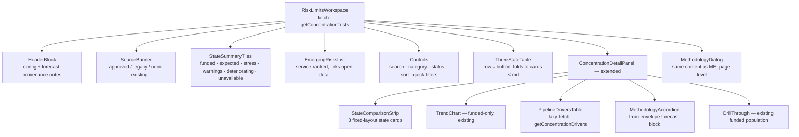

# 07 — Component hierarchy, interaction, accessibility

## Component tree (annotated)



Data flow: ONE `getConcentrationTests` call supplies header, tiles, risks,
table and detail (per-test three-state block travels on each test row).
Drivers are lazy per test. Nothing is computed client-side beyond formatting.

## Terminology (fixed)

* **Funded** — sublabel "contractual".
* **Expected Forecast** — sublabel "prediction"; methodology always one click
  away.
* **Full Pipeline** — sublabel "stress — max exposure"; never abbreviated to
  "forecast" or "projection".
* Movement column is "Move F→E". Risk chips: BREACH, EXPECTED BREACH,
  LOW HEADROOM, DETERIORATION, STRESS ONLY, LIMITED, UNAVAILABLE, OK.

## Status hierarchy

Row severity (drives default sort and the detail badge), most severe first:

1. funded breach
2. expected breach
3. expected warning with headroom below the configured buffer
4. material deterioration (funded period change adverse beyond buffer)
5. full-pipeline-only breach
6. data / methodology limitation (unavailable, insufficient history,
   indicative-only family)
7. pass

Within a band, ascending expected headroom breaks ties; then name. The
ordering is computed by the intelligence service and shipped as `riskRank` —
the UI sorts by the shipped rank.

## Interaction notes

* Row = `<button aria-expanded>`; Enter/Space toggles the detail panel;
  Escape closes it (matches existing modal convention).
* Accordions use `aria-expanded` + chevron rotation (existing pattern).
* Quick filters are `aria-pressed` toggle buttons.
* Driver rows are static (no nested interactive elements) except a
  "show all" reveal.
* The prior-period toggle from phase 1 remains, affecting the Funded column
  only (forecast states have no governed prior).

## Accessibility

* Every status conveyed by ≥ 2 non-colour signals: glyph inside the badge +
  status word; risk chips are words.
* State columns carry `<th scope="col">`-equivalent labels including the
  sublabel ("Full Pipeline, stress, maximum exposure") for screen readers via
  `aria-label` on the header cells.
* The emerging-risks list is an ordered list (`<ol>`) — rank is semantic.
* Charts keep `role="img"` + descriptive labels; the trend chart's aria-label
  states it is funded history only.
* Focus order: controls → table rows → detail panel; the detail close button
  returns focus to the originating row.

## Responsive behaviour

| Breakpoint | Table | Tiles | Detail |
|---|---|---|---|
| ≥ lg | 7-column grid | 6-across | 2-column dl + 3 state cards in a row |
| md | 7-column grid (tighter), horizontal scroll inside the card if needed | 3-across | state cards in a row, dl single column |
| < md | stacked cards per test (06) | 2-across | full-width, state cards stacked |
```
