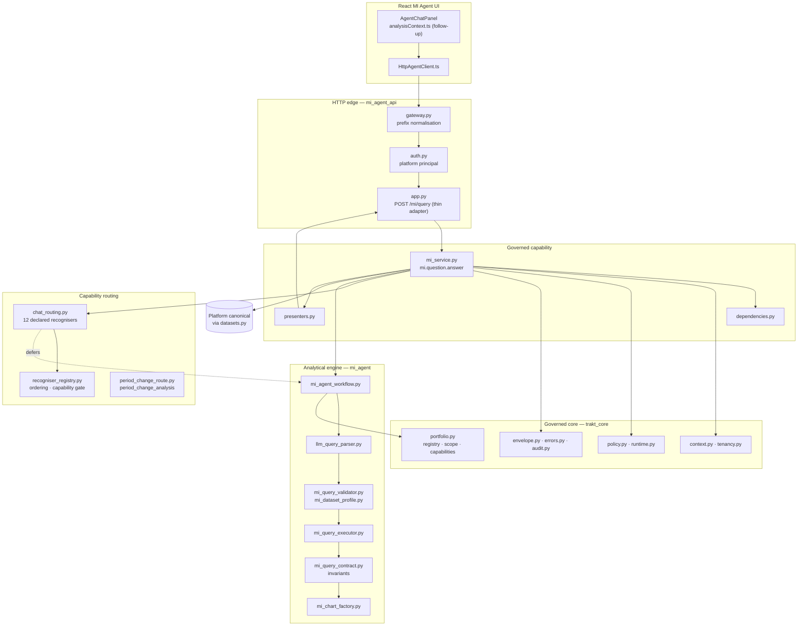
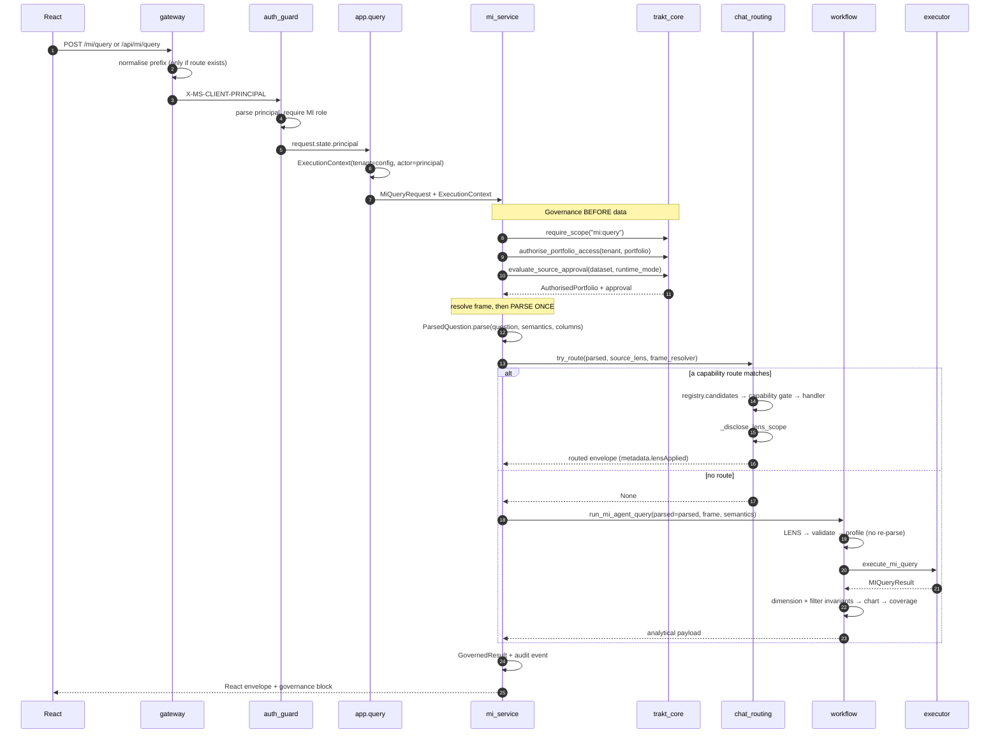
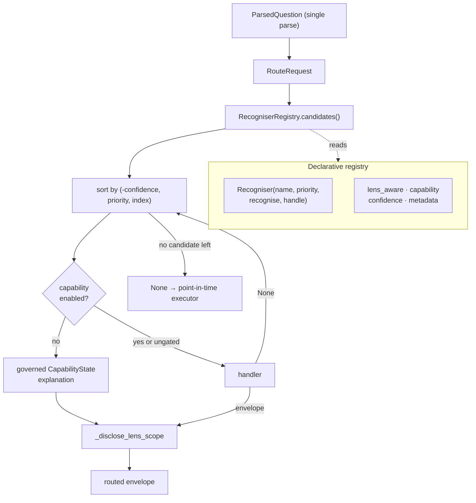
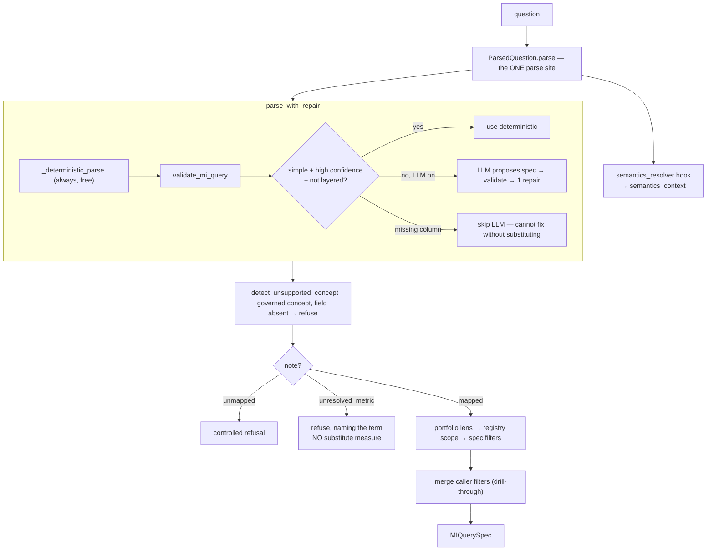
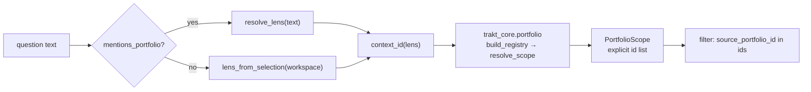
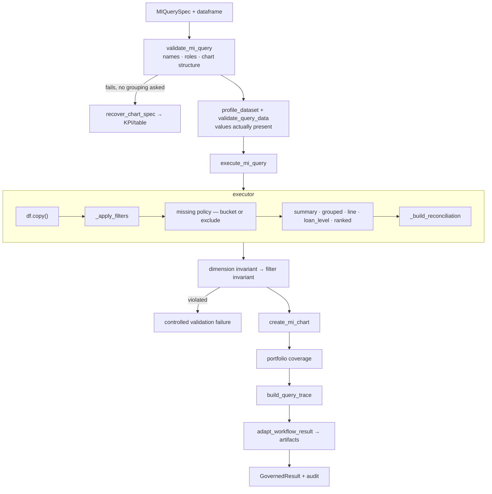
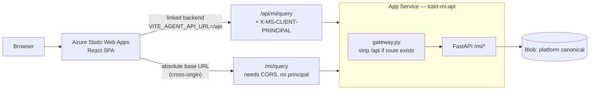
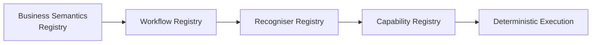
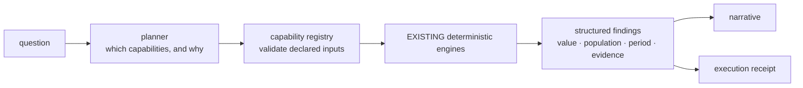

# MI Query Agent — Architecture Reference

**Status:** authoritative. **Scope:** the MI Query chatbot (`POST /mi/query`) and
the query infrastructure beneath it. Dashboard REST endpoints, PPTX, onboarding,
canonical transformation, the platform assembler, regime reporting and blob
orchestration are out of scope and are referenced only where the agent consumes
their output.

**Purpose.** Extend the design described here rather than adding parallel logic.
Where this document names a file as the *owner* of a responsibility, that is
where a change belongs. §10 records what is genuinely unfinished, so a
maintainer can tell a deliberate boundary from an accident.

Companion documents: `docs/mi_query_agent_production_readiness_review.md` (the
evidence behind §10), `docs/governed_capability_architecture.md` (the governance
contract this agent implements).

---

## 1. High-level architecture



### Responsibilities

| Component | Owns | Must not |
|---|---|---|
| `HttpAgentClient.ts` | Transport, envelope translation | Resolve portfolios, compute anything |
| `analysisContext.ts` | **Follow-up resolution** (client-side) | Be the only place a follow-up can be understood (§4.7) |
| `gateway.py` | Path normalisation across deployment topologies | Change routing semantics |
| `auth.py` | Parsing the platform-injected principal, role gating | Validate tokens (the platform does) |
| `app.py` | HTTP ↔ capability translation, status mapping | Parse, route, calculate, resolve datasets |
| `mi_service.py` | **The governed capability.** Scope → tenancy → source approval → execution → envelope | Import FastAPI; know a wire format |
| `recogniser_registry.py` | Declarative registration, deterministic ordering, capability gating | Know what any individual capability does |
| `chat_routing.py` | The registered recognisers and their handlers | Compute point-in-time analytics; re-parse the question |
| `period_change_route.py` | Adapter for the governed Period Change Analysis workflow (`mi_agent/period_change`): snapshot supply, error mapping, rendering. See [`period_change_analysis_workflow.md`](period_change_analysis_workflow.md) | Calculate anything |
| `parsed_question.py` | THE single parse of a question, plus the BSR metadata slot | Interpret `semantics_context` |
| `mi_agent_workflow.py` | Point-in-time orchestration: parse → lens → validate → execute → invariants → chart | Know about HTTP or channels |
| `llm_query_parser.py` | Question → `MIQuerySpec`. **Proposes only** | Execute, or read data values |
| `mi_query_executor.py` | The single calculation engine | Parse, or decide policy |
| `mi_query_contract.py` | Fail-closed dimension/filter invariants + query trace | Fix a violation silently |
| `trakt_core/*` | Identity, policy, portfolio registry, envelope, error taxonomy | Import anything above it |

### Dependency boundaries

Two rules are **enforced by `tests/test_governance_dependency_direction.py`**:

1. **`trakt_core` imports no web framework.** Pure governance primitives.
2. **`mi_service` imports no FastAPI**, at source level or at call time. This is
   what lets Copilot, a job or a future adapter reuse the identical capability.

A third rule is **the design intent but is not fully enforced**:

3. **`mi_agent` (the engine) knows nothing about channels, HTTP or tenancy.** It
   receives a dataframe and semantics. Holds for the whole query path — but
   `mi_calibration.py` and `mi_query_harness.py` import
   `mi_agent_api.adapters.adapt_workflow_result` upward, inside a `try/except`
   that degrades to `None`. Both are **offline tooling**, not the request path,
   and the guard keeps `mi_agent` importable standalone. Treat it as a known
   exception, not a precedent: **do not add an upward import to any module the
   request path touches.**

The one deliberate inversion in the request path: `mi_service` imports
`mi_agent_api.datasets` *lazily*, inside functions, so dataset resolution stays
interface-neutral without a circular import.

---

## 2. End-to-end request lifecycle



### Where identity and scope are resolved — and why there

| Concept | Resolved in | Source of truth | Rationale |
|---|---|---|---|
| **Tenant** | `app._execution_context` → `dependencies.default_tenant_id()` | **Deployment configuration** (`MI_AGENT_CLIENT_ID`, else the client in `MI_AGENT_PLATFORM_URI`) | Deployment-per-tenant. The tenant is *never* request data — a caller-supplied `client_id` that disagrees is rejected with `TENANT_MISMATCH` |
| **Actor** | `auth.principal_from_request` | Platform-injected `X-MS-CLIENT-PRINCIPAL` | Easy Auth / SWA already validated the login; re-validating would duplicate trust |
| **Portfolio authorisation** | `mi_service` → `trakt_core.tenancy.authorise_portfolio_access` | Tenant registry | Runs **before** any dataframe is touched, so an unentitled caller never causes a read |
| **Source approval** | `mi_service` → `trakt_core.policy.evaluate_source_approval` | Runtime mode + dataset descriptor | Production refuses fixture/synthetic sources |
| **Portfolio lens** (Direct / Acquired / Total / cohort) | Point-in-time: `mi_agent_workflow`. Routed: `chat_routing._resolve_lens` | Question text > workspace selection, resolved through `trakt_core.portfolio` registry | Lens is *analytical scope*, not authorisation. It narrows within what the tenant may already see |

**Lens ≠ authorisation.** Tenancy decides what you *may* see; the lens decides
what you *asked about*. Conflating them would make a UI dropdown a security
control. A user may only ever lens within their authorised portfolios.

---

## 3. Capability architecture



### How capabilities are registered

Declaratively, in `recogniser_registry.py`. One `Recogniser` states everything
about a capability in one place:

```python
Recogniser(
    name="geo_exposure",        # route id, appears as metadata.route
    priority=60,                # deterministic precedence — data, not line order
    capability=None,            # governed CAP_* gate, or None
    lens_aware=True,            # does the handler narrow to the portfolio lens?
    recognise=lambda r: _is_geo_exposure(r.question),
    handle=lambda r: _route_geo(...),
    metadata={},                # reserved for Business Semantics Registry terms
)
```

Guarantees the registry provides that the old `if/elif` chain could not:

* **Deterministic registration** — a duplicate name raises rather than silently
  shadowing an existing route.
* **Deterministic ordering** — candidates sort by `(-confidence, priority,
  registration_index)`; every component is total, so order never depends on
  import order.
* **Behaviour preservation** — every migrated recogniser shares
  `DEFAULT_CONFIDENCE`, so ordering collapses to priority order, which is
  exactly the historical chain. A handler returning `None` falls through to the
  next candidate, as before.
* **Capability gating in one place** — a recogniser declares the governed
  capability it needs, resolved through the same `portfolio_context` service the
  React dashboard uses.

### How to add a capability

1. **Recogniser.** Prefer a spec field set by `llm_query_parser` (declarative,
   testable in isolation) over a string predicate. Return a `bool` or a
   `Recognition(matched, confidence)` when the match strength varies.
2. **Priority.** Pick by *specificity*: narrower intents get lower numbers. A
   capability that overlaps an existing one must sit above it **and** return
   `None` when it cannot answer, so the existing route still runs. Genuinely
   more-specific recognisers may instead declare a higher `confidence` and win
   from any position.
3. **Handler.** Return via `_envelope(...)`; `route=` is the recogniser name.
4. **Lens.** If the handler reads a **dataframe**, apply the lens
   (`_resolve_lens` → `_apply_lens_filter`), pass `lens_applied=True` and set
   `lens_aware=True`. If it reads a **pre-aggregated run artefact**, leave it
   false: the default is whole-book *with disclosure*.
5. **Capability.** Declare `capability=CAP_*` when an unavailable capability is a
   genuine, explainable outcome for a scope (pipeline / origination / cohorts /
   risk). Leave `None` for funded-book routes — every scope with rows supports
   them, and gating costs a context resolution for no decision.
6. **Tests.** Add to the lens matrix (`test_mi_query_lens_matrix.py`), the
   semantic bank (`test_mi_query_capability_matrix.py`) and, for ordering,
   `test_recogniser_registry.py`.

> **The safe defaults are deliberate.** A new route is un-narrowable (disclosed)
> and ungated until it says otherwise, so a forgotten declaration produces an
> over-disclosed answer rather than a mislabelled one.

### Why deterministic capabilities are separated from natural-language parsing

The LLM **proposes an `MIQuerySpec` and nothing else**. It never executes, never
sees raw data, and never chooses a number. Every proposal passes through
`validate_mi_query` (names/roles), `validate_query_data` (values actually
present) and the fail-closed invariants before a figure is produced.

This is what makes the agent governable:

* an answer is always reproducible from `(spec, snapshot)`;
* a hallucinated field fails validation rather than reaching a chart;
* the deterministic path is a complete fallback — the agent is fully functional
  with the LLM disabled, which is how it runs when `ENABLE_LLM_MI_AGENT` is off;
* cost is bounded: `zero_cost_first` skips the LLM entirely for simple,
  high-confidence questions.

---

## 4. Semantic pipeline



### 4.1 Intent recognition

`_deterministic_parse` is an ordered chain. Analytical intents are recognised
**first** so they can never collapse to a point-in-time KPI:

`forecast → bridge → cohort progression → compare → risk limit`
→ filtered count/balance → loan-level drill → heatmap → 2-D grouping
→ ranking → treemap → bubble → scatter → line → bar → KPI → **unmapped**.

`unmapped` is a first-class outcome. `mi_agent_workflow` turns it into a
controlled refusal rather than answering a different question — **the single
most important semantic behaviour in the agent.** The one exception: a question
naming a portfolio scope stays on the summary path, because "show the back book"
*is* a meaningful request.

### 4.2 Entity extraction

| Entity | Owner | Mechanism |
|---|---|---|
| Dimensions | `_explicit_dimensions`, `_registry_dimension_terms` | Registry synonyms + `EXPLICIT_DIMENSION_TERMS`. An explicit term is **never substituted** — if its column is missing, validation fails cleanly |
| Metrics | `_detect_metric`, `_registry_metric_terms` | Registry-driven, with `_PREFERRED_*` tie-breaks |
| Numeric axes | `_scatter_axes`, `_NUMERIC_AXIS_BUCKET` | Bare numeric terms map to bucket dimensions when used categorically |
| Periods | `_detect_periods` | Month names + relative terms |
| Ranking | `_detect_ranking`, `_detect_top_n` | Direction + N, both directions |

### 4.3 Metric recognition

Aggregation is resolved separately from the metric (`_aggregation_intent`), so
"weighted average LTV" and "LTV" select the same field with different
aggregations. `_default_weight` supplies the weight field for `weighted_avg` —
weighting is a property of the **metric in the registry**, not of the question.

### 4.4 Portfolio / lens resolution



Two layers, deliberately separate:

* **`mi_agent/portfolio_lens.py` — recognition only.** Maps language to a
  *named scope*. Pure; touches no data.
* **`trakt_core/portfolio.py` — the governed registry.** Decides what that name
  *contains*, recomputed every call.

Consequences that must be preserved:

* the filter is always the **resolved id list**, never a type string — so a
  group is exactly the sum of its registered members;
* onboarding `direct_004` joins Direct with **no code change**;
* an unrecognised context widens to Total, sets `fell_back_to_total`, **and is
  disclosed** to the user;
* precedence is fixed: **exact cohort id > direct/acquired keyword > total**,
  and a scope named in the question beats the workspace dropdown.

> **Vocabulary rule.** Every `_DIRECT_TERMS` / `_ACQUIRED_TERMS` / `_TOTAL_TERMS`
> entry must be *portfolio-qualified*. A bare measure word ("origination",
> "new lending", "total") silently narrows or widens scope. Guarded by
> `test_measure_vocabulary_is_not_read_as_a_portfolio_scope`.

### 4.5 Filters

Predicates are parsed **per clause** (`_CLAUSE_SPLIT_RE`: `and | with | where |
whose | having`). A threshold resolves against its own clause or not at all — it
is never bound to a field named elsewhere in the question.

Three outcomes, all visible:

| Outcome | Result |
|---|---|
| Field resolved | Applied to the mask **before** aggregation, over the full dataset |
| Field unresolvable, predicate **narrows** a valid question | Question answered, filter listed in `unavailable_filters` and surfaced as a warning |
| Field unresolvable, predicate **is** the question | `unmapped` → refusal |

Applied filters are then checked by `check_filter_invariant`: a parsed filter
that reached neither the mask nor a rejection reason **fails the answer**.

### 4.6 Groupings

1–2 dimensions → chart (bar / line / heatmap). 3+ → `_build_multi_dim_table_spec`
(a pivot). Every parsed dimension must be applied or explicitly rejected with a
reason — `check_dimension_invariant` refuses the answer otherwise. A silently
dropped dimension is treated as a correctness failure, not a warning.

### 4.7 Follow-up context

**Entirely client-side**, in `frontend/mi-agent-ui/src/lib/analysisContext.ts`.
`looksLikeFollowUp` detects connective phrasing; `resolveFollowUp` rewrites it
into a **standalone question + filters** using the last successful spec, then
sends it through the unchanged `/mi/query` flow. Unresolvable follow-ups fall
back to sending the raw text.

**The backend is stateless and has no concept of a conversation.** That is a
deliberate simplification (it keeps `/mi/query` idempotent and auditable), but it
means every non-React caller — Copilot, jobs, future agents — has no follow-up
support at all. See §10.4.

---

## 5. Execution pipeline



### Query planner

There is **no separate planner object**. Planning is distributed across
`validate_mi_query` (structural feasibility), `validate_query_data` (value-level
feasibility) and the executor's own branching on `aggregation` / `ranking_mode` /
`chart_type`. The `MIQuerySpec` *is* the plan.

This is a real simplification, not an omission — a spec is inspectable, diffable
and reproducible. The cost is that plan *decisions* (why this aggregation, why
this shape) are only visible after execution, via `build_query_trace`.

### Executor

`mi_query_executor.execute_mi_query` is **the single calculation engine** for the
chat path. Aggregations: `sum`, `avg`, `median`, `count`, `count_distinct`,
`weighted_avg`, `balance_sum`, `distribution`, `loan_level`.

Correctness properties worth protecting:

* **Total is computed in one pass over raw rows** — never as an aggregate of
  per-portfolio aggregates. No double counting.
* **Weighted average is `Σ(v·w)/Σ(w)` over the whole scope** with a shared
  non-null mask — never a mean of per-portfolio means.
* Missing dimension values are **bucketed** as "Unknown / Missing" by default so
  results reconcile to the funded book; excluding them is opt-in and disclosed.
* Every result carries a **reconciliation block** (records/balance included vs
  excluded, coverage %), and material exclusions become user-visible warnings.

> **A second runtime exists.** `mi_agent/mi_runtime.py::run_mi_query` dispatches
> flat/state/temporal/risk modes and is used **only** by
> `interpreter/runtime_bridge.py`. The production chat path does **not** use it.
> See §10.3 before building on either.

### Governed response envelope

`trakt_core/envelope.py::GovernedResult` carries capability id, status
(`success | error | blocked`), request/correlation ids, `SnapshotRef`,
`PolicyState`, `ScopeRef`, `ProvenanceRef`, typed error and `AuditMetadata`.
`presenters.to_react_payload` returns the analytical dictionary **verbatim** plus
one additive `governance` key — which is why the envelope could be introduced
without breaking the React contract.

**Invariant: the envelope states the scope the answer *has*, not the scope
requested.** A route that could not narrow is stamped Total and discloses it.
Violating this makes the governance block a misattribution mechanism.

---

## 6. Error handling

### Taxonomy

`trakt_core/errors.py` holds one table mapping code → (category, retryable, HTTP
status). Adapters read the table; they never invent a status.

| Category | Codes | Status |
|---|---|---|
| Authentication | `AUTHENTICATION_REQUIRED`, `_INVALID` | 401 |
| Authorisation | `PERMISSION_DENIED`, `SCOPE_MISSING`, `TENANT_MISMATCH`, `PORTFOLIO_NOT_AUTHORISED` | 403 |
| Input | `INVALID_INPUT` | 400 |
| **Capability** | `UNSUPPORTED_QUESTION`, `AMBIGUOUS_QUESTION`, `NO_MATCHING_RECORDS`, `CALCULATION_FAILED` | **200** |
| Policy / data | `DATA_SOURCE_NOT_APPROVED`, `_UNAVAILABLE`, `DATASET_MANIFEST_MISSING` | 503 |
| Artefacts | `ARTEFACT_NOT_FOUND` | 404 |
| Infrastructure | `STORAGE_UNAVAILABLE`, `INTERNAL_ERROR` | 500 |

**Capability failures are HTTP 200 with `ok:false`.** "I will not answer that" is
a valid governed answer, not a transport error. `STATUS_BLOCKED` distinguishes a
*policy refusal* from a *capability failure* without parsing prose.

> The query capability never raises `ARTEFACT_NOT_FOUND`, so **`/mi/query` cannot
> return 404**. A 404 therefore always means the request never reached the app —
> see §7.

### Disclosure

Disclosure is a first-class output, not logging. Five mechanisms:

| Mechanism | Discloses |
|---|---|
| `warnings[]` | Scope applied, scope *not* narrowed, unapplied filters, coverage shortfalls |
| `validation.errors[]` | Why an answer was refused, with the exact field/reason |
| `reconciliation` | What share of the book the answer covers |
| `portfolioCoverage` | Which portfolios answered, which could not, per field |
| `metadata.lensApplied` | Whether the figures are lens-scoped |

### Fallback behaviour

| Failure | Behaviour |
|---|---|
| Routing raises | Caught in `mi_service._run_analysis`; falls back to point-in-time. **Silent — see §10.5** |
| Chart cannot render | Table still returned, warning added |
| LLM unavailable but enabled | Deterministic parse, **warning surfaced** — a config fault must not be a silent downgrade |
| Validation fails, no grouping requested | `recover_chart_spec` auto-corrects to KPI/table. Never when grouping *was* requested |
| Engine raises | Logged with type; user sees a generic message. Internal class names are never returned |

### Unknown capability handling

* **Unknown question** → `unmapped` → refusal naming what the agent *can* do.
* **Known concept, field absent** → `_detect_unsupported_concept` names the
  missing fields and states that no value was fabricated.
* **Known capability, no data** → currently a data-availability error rather than
  the governed `CapabilityState` explanation (§10.6).

---

## 7. Deployment architecture



### Route topology

| Topology | Build config | App Service receives | Auth |
|---|---|---|---|
| **SWA linked backend** (recommended) | `VITE_AGENT_API_URL=/api` | `/api/mi/query` | Easy Auth injects the principal |
| Absolute base URL | `VITE_AGENT_API_URL=https://trakt-mi-api…` | `/mi/query` | No principal; needs `MI_AGENT_ALLOWED_ORIGIN` |

### Why the routing contract now works

Previously the API served **only** the bare paths. Static Web Apps forwards
linked-backend traffic **with the path intact**, so the App Service received
`/api/mi/query`, had no such route, and returned **404 for every question** — the
production symptom. Nothing tested the relationship between the paths the client
calls and the paths the app serves, so 1205 passing tests never saw it.

Four changes make the contract explicit:

1. **`gateway.py`** strips `MI_AGENT_API_PREFIX` (default `/api`) **only when the
   remainder resolves to a route the app actually serves** — so both topologies
   work and an unknown path still 404s with its own path. Installed *outermost*,
   so CORS, the auth guard and the router all see one normalised path.
2. **`MI_AGENT_ALLOWED_ORIGIN`** adds the deployed front end to the CORS
   allow-list. There is still deliberately no wildcard.
3. **`GET /health` reports `routing.apiPrefix` and `routing.queryPaths`** — a
   deployment is diagnosable with one curl instead of a build log.
4. **`staticwebapp.config.json`** excludes `/api/*`, `/mi/*`, `/health`, `/me`
   from the SPA navigation fallback, so an API call can never be answered with
   `index.html`.

Enforced by `mi_agent_api/tests/test_mi_query_route_contract.py`, which reads the
literal paths out of the shipped `HttpAgentClient.ts` and requires every one to
be servable **bare and prefixed**.

```bash
curl -s https://trakt-mi-api.azurewebsites.net/health | jq .routing
# {"apiPrefix": "/api", "queryPaths": ["/mi/query", "/api/mi/query"]}
```

---

## 8. Extension points

| To add… | Change | Do **not** |
|---|---|---|
| **A metric** | `config/system/fields_registry.yaml` → regenerate `mi_agent/mi_semantics_field_registry.yaml` (`build_mi_semantics_registry.py`). Set role, format, synonyms, default weight | Add a metric name to parser code |
| **A dimension** | Same registry. Add synonyms; `_registry_dimension_terms` picks them up | Extend `EXPLICIT_DIMENSION_TERMS` unless the term is genuinely non-registry |
| **A synonym** | Registry `synonyms` list | Add a substring test to the parser |
| **A semantic recogniser** | `llm_query_parser.py` — a `_*_recognizer` returning `(spec, meta)` or `None`, inserted by specificity | Add recognition logic to `chat_routing` |
| **A capability route** | `chat_routing.py` — recogniser + `_route_*` + `_LENS_AWARE_ROUTES` (§3) | Compute point-in-time analytics in a route |
| **An aggregation** | `mi_query_executor.aggregate_series`, plus the allow-lists in `mi_query_spec.py` (`AGGREGATIONS` / `OUTPUT_FORMATS`) that `mi_query_validator` checks against | Aggregate outside the executor |
| **A portfolio** | Onboarding stamps provenance; `config/client/portfolio_registry*.yaml` supplies metadata | Reference an id in code |
| **A portfolio capability rule** | `trakt_core/portfolio.py::resolve_capabilities` | Infer capability from a portfolio's name or type |
| **A channel** | New adapter calling `mi_service.execute_governed_mi_query` + a presenter | Re-implement parsing or routing |
| **A chart type** | `mi_chart_factory.py` + validator chart roles | Emit chart config from the parser |

### File ownership

```
trakt_core/            governance primitives — depends on nothing above
  portfolio.py         registry, scope resolution, capability states
  errors.py            THE error taxonomy + HTTP status table
  envelope.py          GovernedResult
mi_agent/              the analytical engine — no HTTP, no tenancy
  llm_query_parser.py  question → MIQuerySpec (proposes only)
  portfolio_lens.py    portfolio LANGUAGE recognition only
  portfolio_scope.py   dataframe-facing scope + coverage
  mi_query_executor.py THE calculation engine
  mi_query_contract.py fail-closed invariants
  mi_agent_workflow.py point-in-time orchestration
  parsed_question.py   THE parse entry point + BSR metadata slot
mi_agent_api/          HTTP + governed capability
  mi_service.py        THE governed capability (parses ONCE, here)
  recogniser_registry.py  routing contracts, ordering, capability gate
  chat_routing.py      the registered recognisers + handlers
  gateway.py           deployment-topology normalisation
  app.py               thin HTTP adapter
  presenters.py        wire formats
```

---

## 9. Architecture diagrams

The four required views are placed **next to the text they explain** rather than
collected at the end, so a maintainer reading a section sees its diagram. Index:

| Diagram | Section | Shows |
|---|---|---|
| **Component / dependency map** | §1 | Major components, layers and allowed dependency directions |
| **Request flow** | §2 | React → gateway → auth → capability → routing → engine → envelope, as a sequence, including where governance runs |
| **Capability architecture** | §3 | The recogniser registry, deterministic ordering, the capability gate and the lens-disclosure exit |
| **Semantic pipeline** | §4 | The single parse site, the BSR hook, refusal branches, lens and filters |
| **Lens resolution** | §4.4 | Question vs workspace precedence, and the handover to the governed registry |
| **Execution pipeline** | §5 | Validate → profile → execute → invariants → chart → coverage → governed envelope |
| **Deployment topology** | §7 | SWA, both route topologies, gateway normalisation, App Service |

All diagrams are Mermaid, validated by parsing, and render natively in GitHub. Keep them at this level
of detail: they are a **map, not a specification** — the owning source file is
always the authority, and a diagram that tries to mirror every branch will rot.

---

## 10. Technical debt

Ordered by the cost of leaving it. Each is evidenced in the readiness review.

### ~~10.1 Two intent taxonomies, and the question is parsed twice~~ — **RESOLVED**

`mi_service._run_analysis` now resolves the frame, parses **once** via
`ParsedQuestion.parse`, and threads the result through both the recogniser
registry and the workflow. Routing and execution share one spec object, so they
cannot disagree. Guarded by `test_single_parse_and_substitution.py`.

### ~~10.2 The ordered `if` chain has no confidence arbitration~~ — **RESOLVED**

Replaced by the governed `RecogniserRegistry` (§3): declarative registration,
deterministic ordering by `(-confidence, priority, registration_index)`,
duplicate names refused. Migrated recognisers share `DEFAULT_CONFIDENCE`, so
ordering reproduces the historical chain exactly; a future recogniser may
declare higher confidence to win from any position. Guarded by
`test_recogniser_registry.py`.

*Still open within this area:* the router selects the first candidate whose
handler answers; it does not yet **report** the runner-up as an ambiguity. The
candidate list is already ordered and available, so surfacing it is additive.

### 10.3 Two runtimes

`mi_agent_workflow.run_mi_agent_query` (production chat) and
`mi_agent/mi_runtime.run_mi_query` + `mi_agent/interpreter/` (Phase 8) are
parallel stacks. The interpreter has a cleaner contract; the workflow has the
invariants and the lens. Neither is redundant today and neither is authoritative.

**Fix:** decide which is the target and migrate, or document the split as
permanent. Do not build new capability on either without deciding.

### 10.4 Follow-up context is client-side only

`analysisContext.ts` is a good implementation in the wrong tier: Copilot, jobs
and future agents get no follow-up support. It also creates a seam mismatch — the
client emits `"… as a table"` and the backend's `output_format` field is
validated but **never set from output-format phrasing**, so the request has no
effect (both artifacts happen to be emitted, which is why it has not hurt).

**Fix:** server-side conversation context on the request contract; wire
output-format phrasing to `output_format`.

### 10.5 Routing failures are silent

`mi_service._run_analysis` wraps `try_route` in a bare `except Exception`. A
configuration fault (e.g. no onboarding output root) disables **every** routed
capability with only a log line; the user gets a degraded point-in-time answer
and is told nothing.

**Fix:** distinguish "no route matched" from "routing failed" and disclose.

### ~~10.6 Capability states are not consulted by the chat~~ — **RESOLVED**

A recogniser declares the governed capability it needs; the router resolves it
through the SAME `portfolio_context.resolve_context` the React dashboard uses
and returns the governed `CapabilityState.detail` when it is unavailable. One
resolution per request, cached, and only for gated routes.

Two deliberate non-gates, both tested: an **unresolvable** gate (storage/config
fault) attempts the route rather than claiming the analysis is inapplicable; and
a deployment with **no portfolio registry at all** (a canonical tape without
provenance — the current ERE production shape) reports
`NO_PORTFOLIOS_IN_SCOPE` for every capability, which means "provenance
unavailable", not "inapplicable", so it is not gated.

*Still open within this area:* the point-in-time `pipeline`/`forecast` **views**
still surface a data-availability error from frame resolution rather than the
governed capability explanation. Only the routed capabilities are gated.

### ~~10.7 Refuse-rather-than-substitute is incomplete~~ — **RESOLVED for metrics**

A grouped question whose metric side carries an unresolvable noun phrase now
returns a governed refusal naming the term, with `unresolved_metric` in
`validation.errors` and no substitute measure. Analytical *framing* words
("concentration by region", "coverage by borrower type", "regions with the most
loans") still default to balance — nothing was named to substitute for, and that
is long-standing governed behaviour.

*Still open within this area:* the residue detector is vocabulary-based
(`_METRIC_SIDE_STOPWORDS` + `_ANALYTICAL_FRAMING_WORDS`). It is conservative —
it refuses only what it is confident is a named-but-unknown measure — so a novel
framing word could be misread as a measure. The Business Semantics Registry
replaces this heuristic with a governed term list; see §11.

### 10.8 Executor performance

`_grouped_aggregate` iterates groups in **Python**, calling `aggregate_series`
per group. Plus ~5 full-frame copies per query, and `profile_dataset` re-runs a
full column profile every request. Adequate at current volumes; **the binding
constraint when larger portfolios are onboarded.**

**Fix, in order:** vectorise `_grouped_aggregate`; filter before copying; cache
the profile on the dataset signature.

### 10.9 Known capability gaps

Tracked as `strict` xfails in `test_mi_query_capability_matrix.py`, so the
documented matrix cannot drift: quarterly grain, year-on-year, `count_distinct`,
share-of-book percentages, and **explanatory intents** ("why", "what explains",
"what are the main drivers"). Each currently returns a plausible unrelated figure
with `ok:true` — the most damaging failure mode an MI agent has. The
`_route_period_movement` attribution engine already computes driver
decomposition; it is simply not reachable from an explanatory question.

### 10.10 Residual hard-coded assumptions

* `_COHORT_ID_RE` recognises only `direct_<n>` / `acquired_<n>` in **natural
  language**, so a portfolio named outside that convention (e.g.
  `alp_origination`) is selectable in the dropdown but cannot be named in a
  question.
* `portfolio_lens.available_lenses` still infers `funded_only` from
  `type == "acquired"` — the assumption `resolve_capabilities` exists to replace.
* Client-specific field preferences (`erm_product_type`, `broker_channel`) and
  bubble-axis heuristics live in parser code rather than the registry.
* The unknown-portfolio fallback is disclosed on the point-in-time path but not
  on routed answers.

### Intentionally deferred

* **No server-side result cache.** Dataset and semantics are cached and warmed;
  results are not. Correct while the tape is small and freshness matters more
  than latency.
* **No separate planner object.** The spec *is* the plan (§5).
* **Tenant is deployment configuration, not request data.** Revisit only if
  multi-tenant-per-deployment becomes real; it is a security-relevant boundary.
* **The backend is stateless per question.** Keeps `/mi/query` idempotent and
  auditable; revisit with §9.4.

---

## 11. Accommodating the Business Semantics Registry

The Business Semantics Registry (BSR) is being built separately and will become
the semantic foundation for future reasoning workflows — period change analysis,
portfolio risk comparison, covenant headroom, driver attribution. **None of
those are built here**, and no temporary semantic layer was introduced that
would have to be unpicked when the registry lands.

What exists instead are four seams, each already exercised by a test.

### The intended end state



Today's shape is the same chain with the first two boxes absent:
**Question → Recogniser Registry → Capability Resolution → Deterministic
Capability → Governed Response.** Adding the missing boxes is registration, not
restructuring.

### The four seams

| # | Seam | Where | What plugs in |
|---|---|---|---|
| 1 | `semantics_resolver` | `CapabilityDependencies` → `build_dependencies()` | A BSR client, injected once. Reaches every channel at the same time |
| 2 | `ParsedQuestion.semantics_context` | Populated at the single parse site | Governed business-term metadata resolved alongside the spec |
| 3 | `RouteRequest.semantics_context` | Carried into every recogniser and handler | Recognisers read governed semantics with **no signature change** |
| 4 | `Recogniser.metadata` | Declared per recogniser | A workflow recogniser declares the business terms, comparison bases or materiality rules it consumes; a BSR-aware loader validates them |

Plus `RecogniserRegistry.register` is public and additive, so a BSR-driven
loader can register recognisers **from configuration at startup** rather than
from code.

### What lands where, when the BSR exists

1. **Wire the resolver** — one line in `build_dependencies()`. Every parse now
   carries governed semantics; nothing else changes.
2. **Replace the residue heuristic** — §10.7's vocabulary-based unresolved-metric
   detector becomes a registry lookup: "is this a governed business term?"
   `_metric_side_residue` is the only function to replace, and its contract
   (phrase in → unresolved term or `None`) already matches.
3. **Add a Workflow Registry above the Recogniser Registry** — workflow
   recognisers register like any other, declaring their BSR terms in
   `metadata` and a higher `confidence` so a genuine workflow question outranks
   the single-capability recogniser that would otherwise catch it. The ordering
   rule already supports this; **no change to the registry is required.**
4. **Capability resolution stays as-is.** `Recogniser.capability` already gates
   on governed `CapabilityState`. A workflow needing several capabilities
   resolves each through the same `resolve_capability_state` — the multi-
   capability orchestration lives in the workflow layer, not here.

### What was deliberately NOT done *(at the time this section was written)*

No period-change analysis, portfolio risk comparison, covenant headroom, driver
attribution, explanatory workflows, workflow planner, materiality logic,
comparison engine or multi-capability orchestration. Routing dispatches to **one
deterministic capability** and stops. The confidence field, the metadata slot and
the semantics context are all *inert* today — carried, never interpreted — which
is what keeps them free of assumptions the real registry would contradict.

---

## 12. The analytical capability layer

Step 3 above has since been taken, and taken as described: **registration, not
restructuring.** `mi_workflows/analytical/` composes two or more governed
deterministic capabilities into one answer, and registers through the existing
registry with no change to it.



| | |
|---|---|
| Route | `analytical_composition`, priority 5, confidence 0.8, `lens_aware` |
| Capabilities | ten, declared in `mi_workflows/analytical/registry.py`, each naming the engine it delegates to |
| Owns a calculation? | **No.** A test parses every module in the package and fails if one imports `pandas` or `numpy` |
| Engages when | the deterministic planner composes **two or more** capabilities |
| Declines when | a single existing route owns the question (`AnalyticalCapability.route_owner`), or a plan produces nothing computable — the handler then returns `None` and the question falls through unchanged |
| LLM role | may PROPOSE a plan (`planner.plan_from_proposal`); the proposal is validated against the registry and rejected whole on an unknown capability, a missing input or a population the question never named. It never calculates |
| Governance | populations go through `mi_agent.population.apply_population`; every plan is checked by `mi_agent.population.fabricated_concepts` before any data is read; the route publishes `metadata.analyticalComposition`, which `execution_receipt.analytical_evidence` reconciles the question's facets against |

**File ownership.** Planning and deference belong in
`mi_workflows/analytical/planner.py`; a capability declaration in
`registry.py`; an adapter over an existing engine in `executors.py`; the answer
shape in `route.py`. A new analytical capability is a declaration plus an
adapter — no change to routing, the receipt or the parser.

Evidence: `due_diligence/MI_AGENT_ANALYTICAL_CAPABILITY_LAYER.md`.

---

## 13. The analytical intent boundary

Section 12 added the capability layer. This section adds the thing that decides
whether a question ever reaches it — and, more importantly, what happens when
nothing can.

**The problem it solves.** Measured across 752 runs of ordinary CFO phrasings
(`due_diligence/MI_AGENT_ANALYTICAL_NL_ROBUSTNESS.md`), every figure the
capability layer produced was right — 2,686 of 2,686 reconciled — and a quarter
of questions still returned a confident answer to a different question. Every
one of those originated *upstream*: no recogniser claimed the question, so it
fell through to the generic point-in-time executor, which answered from one
snapshot of the funded tape with whatever measure and dimension the parse
happened to produce, and the guard passed because it raised no facet at all.

```
"How many loans are we completing at the moment?"  ->  11,035 loans   ok=True
"What completion rate are we running at?"          ->  £1.96bn        ok=True
"Where are we closest to our limits?"              ->  WA LTV by region
"Which of our limits are most at risk?"            ->  balance by account status
```

### Six families, and nothing else

`mi_workflows/analytical/intent.py` recognises a question as belonging to one or
more of six governed families, and to one or more governed operations within
them.

| Family | Governed operations | Who already owns them |
|---|---|---|
| `MIX_PROFILE` | snapshot · composition · comparison · change · divergence · attribution | `analytical_composition`, `period_change_analysis`, `portfolio_summary`, `period_movement` |
| `PIPELINE` | stock · movement · conversion · run-rate · expected completion · timing · mix | `analytical_composition`, `forecast_extrapolation`, `cohort_conversion`, `scenario` |
| `LIMITS_CONCENTRATION` | concentration · status · headroom · ranking · movement · forecast breach | `risk_limits`, `analytical_composition` |
| `FORECAST_PROJECTION` | project value · milestone · horizon · scenario | `forecast_extrapolation`, `scenario`, `analytical_composition` |
| `MOVEMENT_TREND` | delta · trend · ranking · acceleration · attribution | `analytical_composition`, `period_change_analysis`, `period_movement`, `evolution`, `temporal_compare`, `funded_bridge` |
| `VINTAGE_COHORT` | snapshot · comparison · evolution · ranking · divergence | `analytical_composition`, `cohort_progression` |

A test asserts that **every capability and every route named above already
exists**. The boundary can route a question to a governed answer; it cannot
invent one.

The vocabularies are CONCEPT sets — the words a book, a control or a movement is
described with — not question templates. No entry exists because a test phrasing
needed to pass.

### What it does, in three moves

**1. It settles governed intent flags the parser left open.** `try_route` calls
`intent.settle(question, spec)` before any recogniser is consulted. When the
`LIMITS_CONCENTRATION` family is recognised and the parse did not set
`risk_limit_query`, the boundary sets it — and the `risk_limits` route, entirely
unchanged, then claims the question. It never overrides a flag the parser has
already settled, and it never hands a question to a capability that would answer
in the wrong unit: a *"how many"* question is not given to the currency-only
run-rate capability.

**2. It tells the planner what family it is looking at.** The capability layer's
plan builders no longer carry private vocabularies. Two comparison vocabularies
is exactly how *"are X and Y developing differently?"* came to resolve one way
and *"how has X moved relative to Y?"* another, for the same question.

**3. It fails closed.** After the point-in-time executor has run, a structural
check asks whether the answer CARRIES what the question needs — the pipeline
extract, a limit schedule, a forecast, two reporting snapshots, two populations.
If it does not, the answer is replaced by a controlled refusal naming what could
not be established. The check runs after execution, not before, for the same
reason the P0 receipt does: what matters is what the answer demonstrably
carries, not what it was meant to be. An answer that DOES carry the structure —
a front/back comparison reached by grouping on the seasoning segment — is left
completely alone, and a question that is not materially analytical
(*"balance by region"*) is never touched.

### The governed lending ruling

`mi_agent/seasoning.py` gained four **lending windows** on the axis it already
owns, driven by the same `seasoning:` config block:

| Window | Definition |
|---|---|
| NEW | originated in the last **1** month |
| RECENT | originated in the last **3** months |
| FRONT BOOK | originated in the last **12** months |
| BACK BOOK | older than **12** months |

They are **nested, not a partition** — every NEW loan is also RECENT and also
FRONT BOOK — because "new lending" and "the front book" are different questions.
Front and back keep the `seasoning_segment` predicate they already had, so
anything that resolved to them before resolves to identical rows now.

"Lending" is deliberately **not** globally mapped. `_SEGMENT_PHRASES`, which
selects a population everywhere in the stack, was not touched. The role is
resolved by analytical context: a PROFILE / MIX / RISK context makes "new
lending" a population of loans; a RUN RATE / VOLUME / FLOW context makes it an
origination flow. Where context settles neither, no population is created and
the fail-closed rule applies.

| | |
|---|---|
| Module | `mi_workflows/analytical/intent.py` |
| Seams | `chat_routing.try_route` (flag settling, pre-routing) and `mi_service._fail_closed_analytical` (post-execution, point-in-time path only) |
| Owns a calculation? | **No.** It classifies and it routes |
| Evidence published | `metadata.analyticalIntent` — families, operations, signals, lending windows and role, requirements, and any flag it set |
| Tests | `tests/test_analytical_intent_boundary.py` |

Evidence: `due_diligence/MI_AGENT_ANALYTICAL_INTENT_V1.md`.
