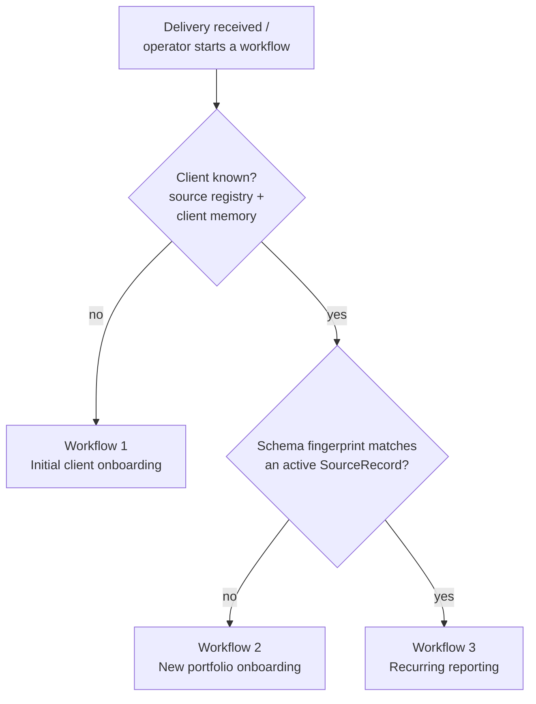
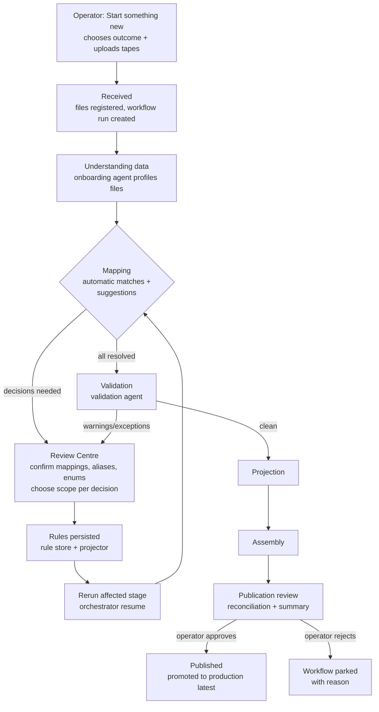
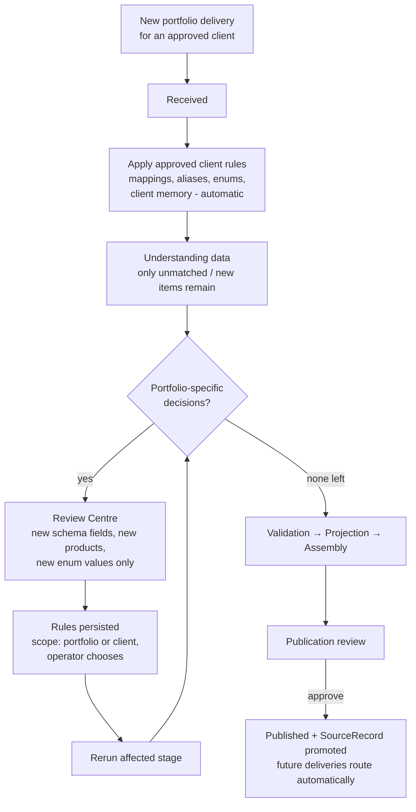
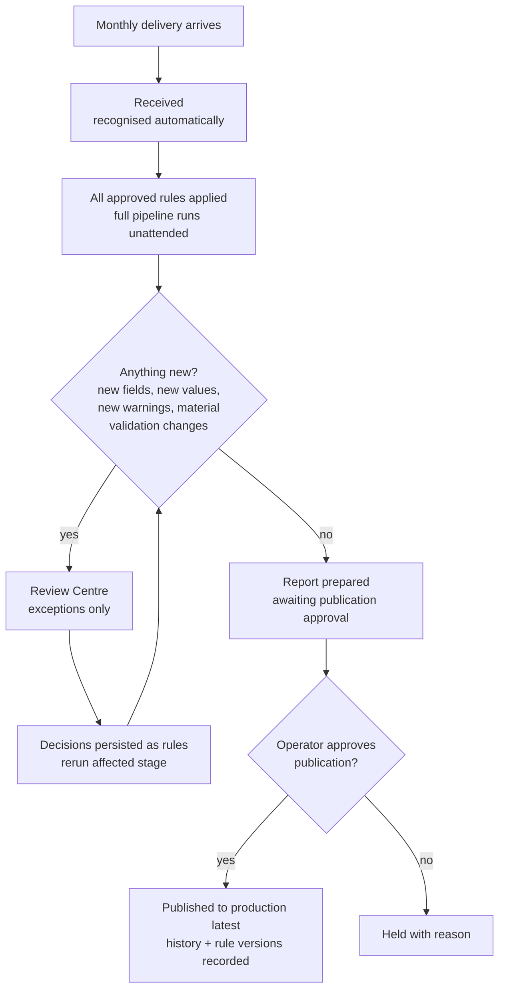
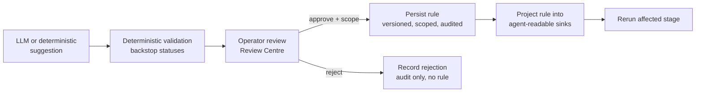

# 03 — Workflow diagrams

Three operational workflows. All three run through the same Workflow State
Engine and the same stage graph; they differ in which rules are pre-applied and
which decisions surface.

## 0. Workflow selection (automatic)

This reuses the classification the blob trigger already performs
(`new_source` / `schema_drift` / deterministic route) — surfaced to the
operator as "new client" / "new portfolio" / "regular delivery".

## 1. Initial client onboarding

Operator experience: guided, stage by stage; every stop is a Review Centre
decision, never a technical screen.

## 2. New portfolio onboarding (existing client)

Key property: approved client-scoped rules are **pre-applied and never
re-reviewed**; only deltas surface. The UI clearly labels the run
"Existing client — new portfolio".

## 3. Recurring reporting

Onboarding is never repeated. A clean month is two clicks: open, approve.

## 4. Historical artefacts (backfill)

Historical deliveries after onboarding follow Workflow 3's shape: approved
rules auto-apply per delivery; the operator reviews only differences between
the historical file and the approved rule set. Runs can be queued per period
and reviewed from the same Review Centre.

## 5. Decision loop (common to all workflows)

No suggestion ever updates a registry without passing through this loop.
