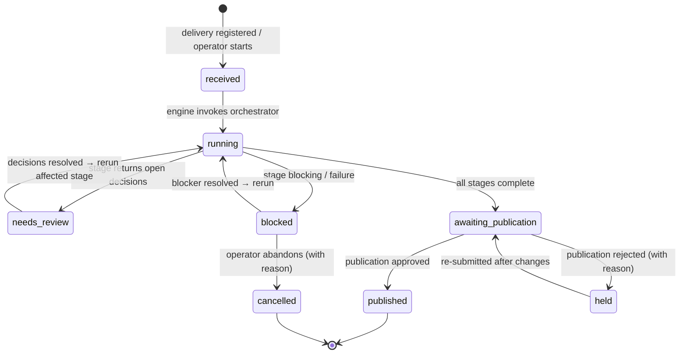
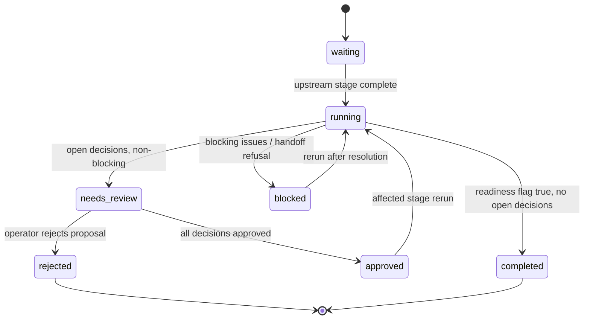
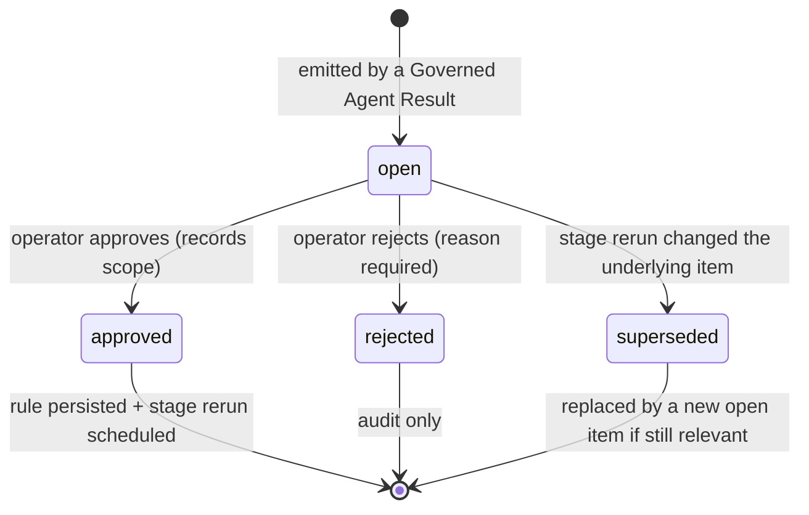
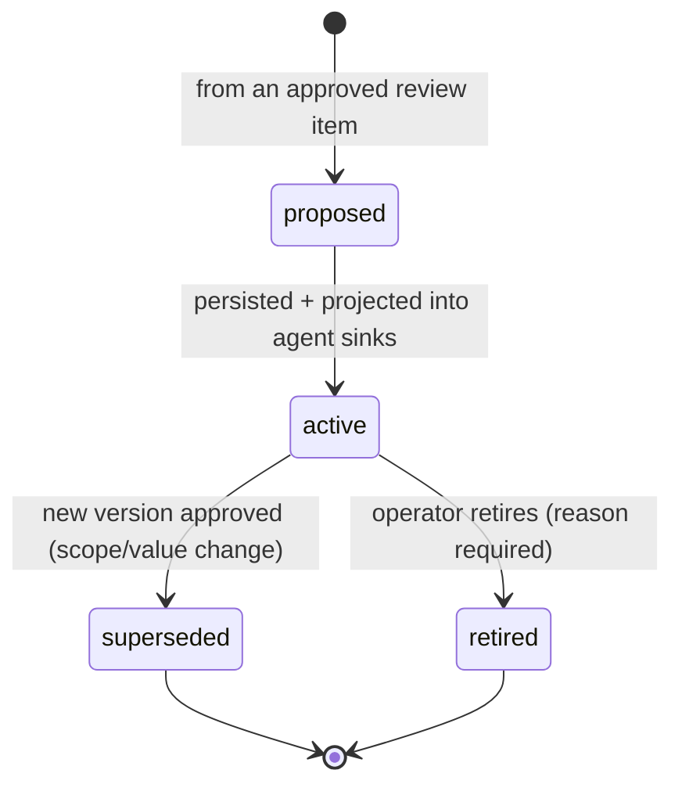
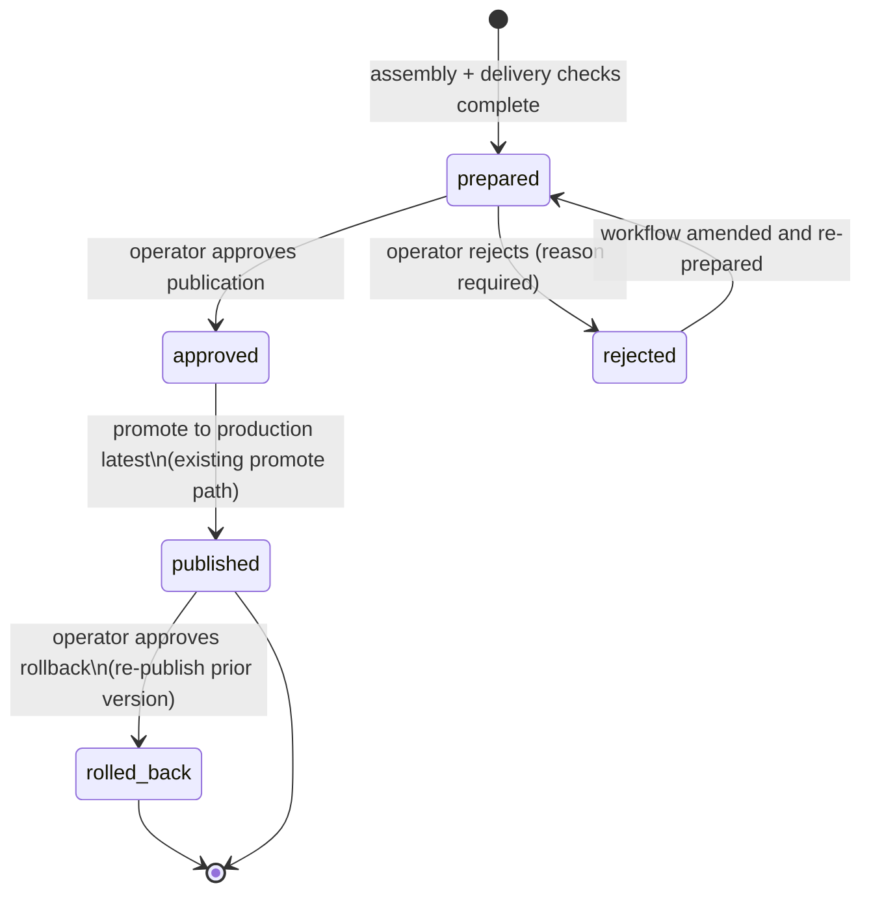

# 04 — State diagrams

Five state machines, all persisted in `operations-control/` (doc 06). Every
transition writes an audit event; illegal transitions are rejected by the
Workflow State Engine, not left to the UI.

## 1. Workflow run

Recovery: `running` is resumable at any time from persisted state
(orchestrator `run_state.json` + workflow record); a crashed run re-enters
`running` via rerun without repeating completed stages.

## 2. Stage (within a workflow run)

Operator-facing statuses (doc 07 §2):

`waiting` renders as **Waiting**, `running` as a quiet in-progress indicator;
the operator vocabulary is exactly: Complete · Needs Review · Blocked ·
Waiting · Approved · Rejected.

## 3. Review item (decision)

An item already approved never re-opens unless the underlying data changed —
in that case a **new** item is raised marked "changed since your approval".

## 4. Rule (persistent operational decision)

Versioning: `superseded` versions are immutable and permanently queryable;
each publication records the exact rule versions it used (doc 06/08).

## 5. Publication

Invariant: no transition into `published` exists except from an explicit
operator `approved`. Agent completion can only ever reach `prepared`.
