# Investor Deck vs MI Dashboard — Critical Review

**Base:** `origin/main` @ `99b46ebc` · **Branch:** `claude/pptx-capability-ux-audit-e0dhph`
**Method:** the deck was generated through the real route (`POST /mi/decks/generate` →
poll → `GET /mi/decks/download`) for five representative books; the React dashboard was
run against the **same API on the same book** with production's build flags
(`VITE_MI_ENHANCED_HOVERS`, `VITE_MI_WEEKLY_BRIEF`) and screenshotted view by view. Every
finding below is from a rendered page or an executed probe, not from reading code alone.

---

## 0. Context that changes how to read this

**None of the PPTX work from the previous five sprints is on main.** Main's history has
since been rewritten, and checked by content (not SHA), the information-first selector,
pipeline stratifications, forecast evolution, the borrowing-base slide, concentration
history, governed currency and the publish fix are all absent. The live deck is the older
24-slide structure. This review is therefore against **main as it is** — which is what
"Generate a new pack" runs.

---

## 1. Is "Investor deck → Generate a new pack" operational?

**In code, yes.** The full chain — React `DeckDownloadMenu` → `POST /mi/decks/generate` →
job thread → `pptx_stage` → `mi_agent_pptx.cli` → publish → `GET /mi/decks/download` — is
covered by `tests/test_deck_generation_route.py` and passes (30/30). The live React build
uses `HttpAgentClient`, which implements `generateDeck`, so the item is offered.

**In the documented deployment, it can fail silently.** Proven by executed probe on main:

| step | result |
|---|---|
| READ path (`storage.decide_backend`) on an App Service with only `AzureWebJobsStorage` | `azure_blob` — the old deck downloads fine |
| WRITE gate (`pptx_stage.pptx_persist_enabled`) on the same environment | `False` |
| `persist_investor_deck(...)` | `None` — nothing uploaded |
| job outcome (`deck_generation._run_generation`) | `COMPLETED` — never reads `artifact["published"]` |

The runbook *advertises* the fallback that triggers this
(`docs/trakt_blob_pipeline_runbook.md:21`: "If unset in Azure, `AzureWebJobsStorage` is used
as a fallback"), and `docs/mi_shared_service_architecture.md:454` records that it already
caused the ERE deck never to be published. The route test forces
`TRAKT_INVESTOR_PPTX_PERSIST=true`, which is why it never sees this.

Two further mechanisms, both verified on main:

- **Local-mirror shadowing.** `decks.resolve_deck_local` prefers `storage._local_path(uri)`,
  guarded only by `hasattr`. `BlobStorage` inherits `_local_path` with `local_root = cwd()`,
  so any `processed-v2/decks/...` tree in the App Service's working directory permanently
  shadows the freshly uploaded blob.
- **Write-once dated copies** (a governance decision, not a bug). Regenerating cannot
  change what "Selected reporting date" downloads for a month already published, and the
  job does not say so.

Deployment note: `deploy-mi-api.yml` runs on `workflow_dispatch` only. Nothing below
reaches the App Service until that workflow is run.

---

## 2. Correctness defects visible in the rendered deck

| # | defect | evidence |
|---|---|---|
| C1 | **Mixed currency.** A EUR book's pack shows € on 2 slides and **£ on 9 (36 occurrences)** — cover and KPIs in €, composition, movement, every stratification takeaway, vintage, cohort and watch items in £. | `seasoned_book_eur`, text layer |
| C2 | **Ordinal bands drawn in balance order.** LTV reads 20–30, 40–50, 50–60, 70–80, 80–90, 60–70, 30–40; ticket and age likewise. The dashboard draws the governed ladder. | deck p.5 vs dashboard Funded › Stratifications |
| C3 | **Rate series not zero-anchored.** WA LTV axis runs 50.25%–50.60%, drawing a 0.35pp drift as a dramatic swing. The dashboard anchors every evolution chart at zero. | deck p.9 vs dashboard Funded › Evolution |
| C4 | **Limits without their operator, headroom without its unit.** "30.0%" for a `≤ 30.00%` test; headroom "15.8". On a minimum-type test the missing operator inverts the meaning. | deck p.20 vs dashboard concentrations |
| C5 | **One-category panel.** "By broker / channel — Direct £104.8MM" spends half a slide, with the takeaway "Direct increased £16.5m, taking its share to 100.0% (+0.0pp)". | deck p.7 |

---

## 3. Design-schema drift

The dashboard's schema (`frontend/mi-agent-ui/src/index.css`) is explicit:
*"Structure comes from SPACING, WEIGHT and CONTRAST; colour is reserved for state and
emphasis."* The deck's palette was updated to Slate & Cyan; its **grammar** was not.

| element | dashboard | deck (main) |
|---|---|---|
| Headline figures | `.t-figure` — **monospace**, 600, tabular | sans bold |
| KPI tile | dark raised card (`navy-800` on the slate panel), uppercase-tracked label, figure, **period delta with arrow**, micro hint | lighter grey box on a dark page, figure only — **`delta` / `deltaIntent` are in the payload and dropped** |
| Direction | leading-edge **rail** coloured mint / rose only where there is movement; neutral is `line-strong` | none |
| Cyan | selected tab, focus ring, chart bars and lines — **nothing decorative** | full-height rail on every slide, cyan straplines, cyan cover elements, cyan rails on every executive-summary card, cyan "Expected" values |
| Card titles | uppercase tracked (`BY LTV BAND`) | title case |
| Status | `✓ PASS` badge | plain "PASS" text |
| Tile grid | 4 columns, content-height | 5 columns, ~50% empty height |

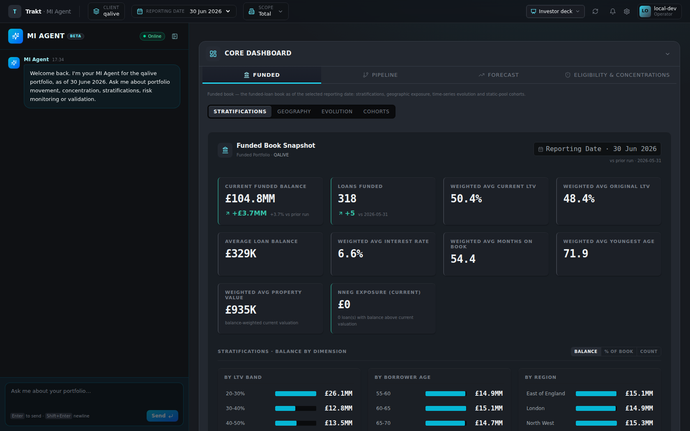
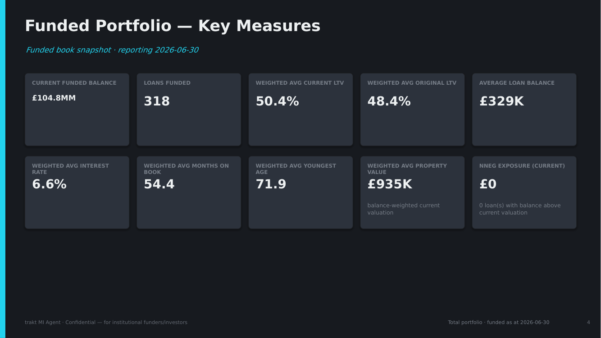

---

## 4. Capability gaps — what the dashboard shows that the deck does not

| dashboard | deck on main |
|---|---|
| **Eligibility & Concentrations › Borrowing base** | none — the concentration envelope the deck already fetches **carries `borrowingBase`; no slide reads it** *(ported in the follow-up, §6)* |
| Concentrations: 6 KPIs incl. **Deteriorating** and **Unavailable**; Funded / Expected / **Full Pipeline** columns; **Move F→E**; 2dp | 5 KPIs, no stress column, no movement, 1dp |
| **Pipeline › Stratifications** | none *(ported, §6)* |
| **Forecast › Forecast Evolution** (actual vs the prior run's forecast) | none *(ported, §6)* |
| Funded › Evolution: balance, **loan count**, WA LTV, **WA rate** | balance and WA LTV only *(ported, §6)* |
| Funded › Cohorts: static pool — seasoning, surviving, retention, roll-up, exits | vintage formation and cohort progression |
| Pipeline › Stage Movement | **parity** — both carry moved / arrived / reconciliation |
| Geography | parity (when ITL3 resolves) |

**Deck-only:** the multi-dimensional cross-tabs (the dashboard never requests `/mi/multidim`).

**Pack length:** 19 / 22 / 22 / 22 / 16 slides — Origination Funnel, Origination Flow and
Pipeline Stage Movement all render on the same book, and three fixed stratification pages
draw six of eleven dimensions whatever the data says.

---

## 5. Recommendations, ranked

1. **Fix the silent publish** (§1) — this is the stale-deck symptom.
2. **Fix currency and ordering** (C1, C2) — a EUR funder currently receives a mixed-currency pack.
3. **Adopt the dashboard's grammar** (§3) — figures, tiles with movement, state-only colour.
4. **Concentration formatting** (C4) and **zero-anchored rates** (C3).
5. **Decide on the unmerged capability work** (§4) — most of these gaps were closed on
   `claude/pptx-analytical-surfacing-final`. Porting it is a larger change than this pass
   and is a decision for the owner, not something to fold in silently.

Sections 6–8 below record what this change implements and how it was verified.

---

## 6. What this change implements

### Generation (§1)

| fault | fix |
|---|---|
| write gate ignored `AzureWebJobsStorage` | `pptx_persist_enabled` now defers to `storage.decide_backend` via `publication_expected()` — one answer to "is there durable storage here" |
| a non-publish reported `completed` | the artifact records `publication_skipped`; `deck_generation.outcome_of` reports **blocked** with the reason, which the dashboard already renders as "Pack withheld" |
| blob shadowed by a stray local tree | `decks.resolve_deck_local` prefers a local file only for the filesystem backend |

Proved through the real HTTP route: a durable store that was not updated returns
`blocked` with *"…downloads still serve the previously published deck. This is a storage
configuration problem, not a problem with the pack."*; local development still completes.

**Not changed — owner decision:** dated period copies stay write-once. That is a
governance property (what a funder received for June is immutable), and changing it is
not a formatting fix.

### Correctness (§2)

| | before | after |
|---|---|---|
| C1 currency | EUR pack: € ×5, **£ ×36** | € ×46, £ ×0 — text layer and chart images |
| C2 ordinal order | LTV 20–30, 40–50 … 30–40 | the dashboard's ladder (`strat_order.py` ports `stratOrder.ts`) |
| C3 rate axes | 50.25%–50.60% | zero-anchored, as every dashboard evolution chart |
| C4 covenants | `30.0%`, headroom `15.8` | `≤ 30.00%`, `15.79pp`, 2dp values, status badge |

The currency fix is **shared**: `insight_generators.money` hard-coded `£` and is used by
the dashboard's own observations too, so a EUR book's dashboard prose was also in sterling.
Sterling books read exactly as before (the governed currency defaults to GBP).

### The prior period — a defect found during the work

The deck resolved "the prior period" only from dated platform-canonical files; the
dashboard's snapshot route discovers prior **runs**. On a book delivered as runs the deck
found none, which caused two visible defects at once:

- every KPI delta the dashboard prints ("+£3.7MM, +3.7% vs prior run") was absent;
- the movement bridge — documented to open at the snapshot's prior period — fell back to
  the earliest period, so the pack printed **Feb→Jun** movement beside one-month headline
  figures. It now reads **May→Jun** throughout, matching the dashboard.

The deck now applies the route's rule first and keeps the dated-cut path as fallback. With
deltas present, the dashboard's rule for hiding redundant "Monthly change" tiles is ported
too (otherwise NNEG exposure was pushed off the slide).

### Design grammar (§3)

- **Elevation:** the slide is the Core Dashboard surface (`#232830`), cards the darker well
  (`#16191f`), tiles `navy-800`, bar tracks the `navy-950` well with a `cyan-500` fill.
- **StatTile:** leading rail coloured only by direction, reserved two-line label band so
  figures share a baseline, monospace figure at one size, delta and hint on one line,
  four across.
- **State-only colour:** no slide rail, no cyan straplines, labels in the ink roles, rails
  coloured only by severity or direction. `deck.py` no longer sets any text in the accent.
- **Theme:** gains the dashboard's full ink ramp, line weights and surface ladder;
  `tests/test_deck_dashboard_design.py` reads `index.css` and fails if a token drifts.

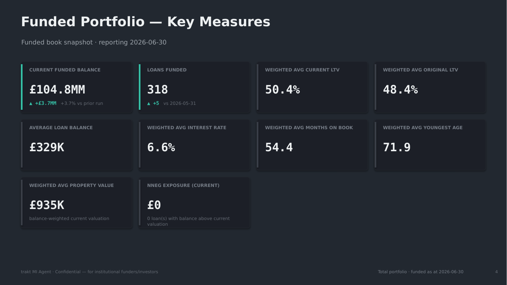
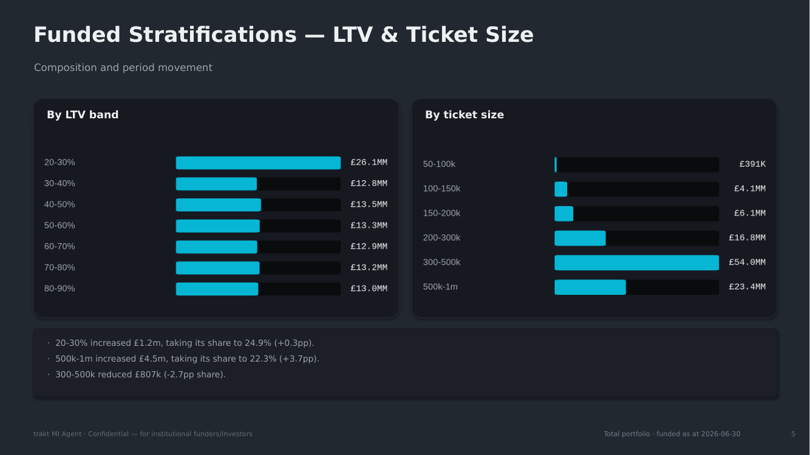
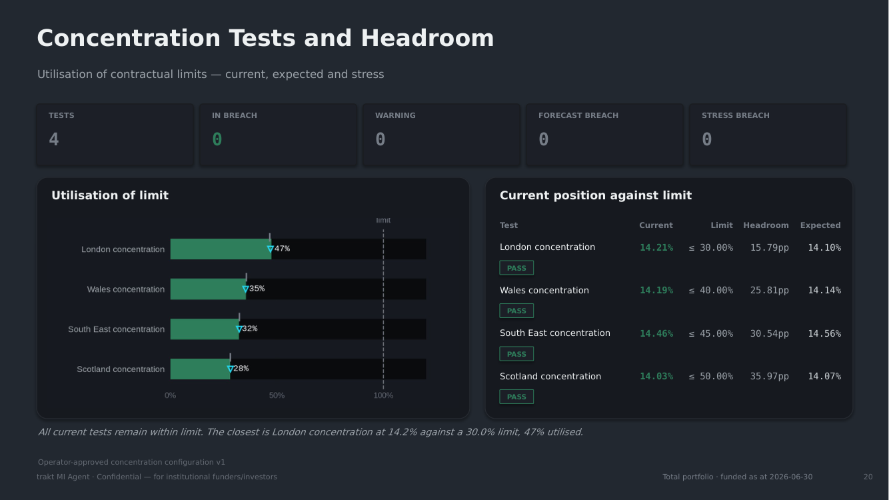

### Borrowing Base — ported (follow-up)

Ported from `claude/pptx-analytical-surfacing-final` (`c2e35e28`), then rebuilt on this
branch's design grammar. It sits **before Concentration** (and so before Risk Limits), as
`BorrowingBasePanel` leads the dashboard's Eligibility & Concentrations tab, and is
**omitted with its reason** where no facility is configured — which is every book today
except the ERE prototype.

- **Same five measures, same order, same tones as the panel:** eligible collateral,
  borrowing base, facility drawn, headroom, facility utilisation — mono figures, headroom
  mint, utilisation amber at 90% and rose at 100%. The eligibility split
  (eligible / ineligible / undetermined) is native, copyable table text with the
  financing-portfolio and concentration-denominator line beneath it.
- **Nothing is computed.** Every figure is `mi_agent.borrowing_base`'s, read off the
  concentration envelope the deck already fetched and was discarding.
- **`NOT_CALCULABLE` is printed as the missing input**, in the panel's words —
  "facility drawings not supplied" — never a dash or a zero. This is the ERE prototype's
  state today: no drawing is supplied, so headroom and utilisation cannot be stated.
- **A defect in the ported code, fixed:** under the prototype assumption every loan is
  eligible *with the prototype reason*, and the "Why loans are not eligible" card listed
  all of them as excluded. Eligible-loan reasons are now filtered out, and a missing rule
  input reads "Input missing — Max current LTV" rather than the derivation's raw code.
- Rendered through the real generate route with two facility registers (the QA harness
  takes `--facility drawn|undrawn`): 23 slides with a facility, 22 without.

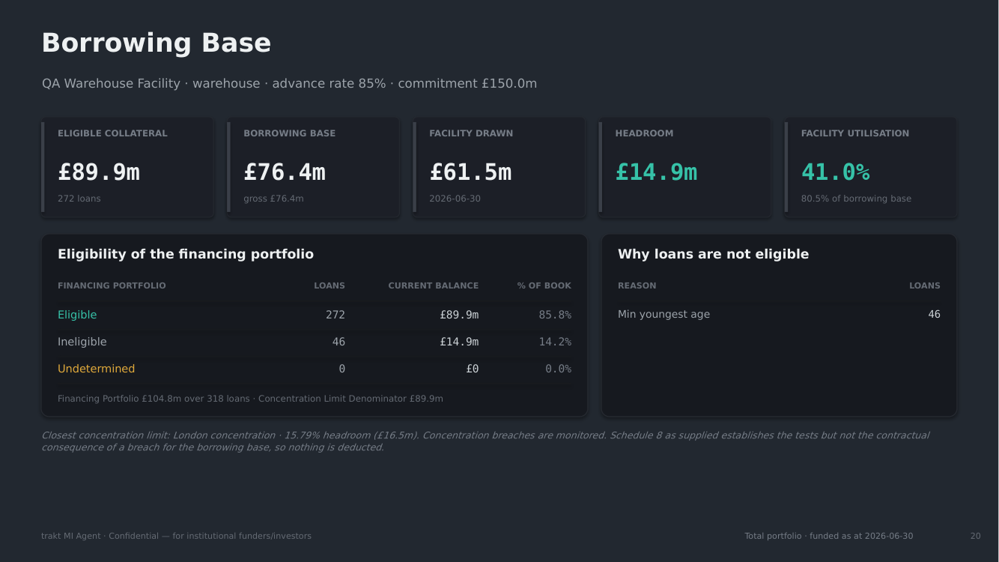
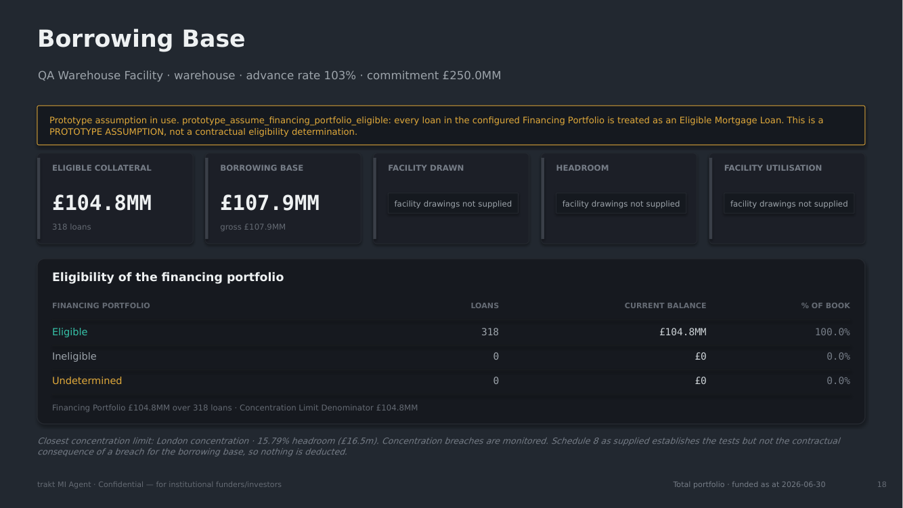

### The remaining capability work — ported (second follow-up)

Everything `claude/pptx-analytical-surfacing-final` built after it last synced with main
(`8958a23c`), brought over as a three-way merge onto this branch (`70f40f4d`). Main's deck
code at `99b46ebc` is byte-identical to that sync point, so the old branch's own work is
exactly `8958a23c..tip`; its report documents and QA artefacts were left behind.

**What the pack gains** (seasoned GBP book, 20 slides, previously 22):

| page | what it answers |
|---|---|
| **Executive Position** | one opening page: funded, pipeline and forecast tiles, the funded trend, the closest limit |
| **Funded Stock** / **Funded Evolution** | balance over time; balance, loan count, WA LTV and WA rate by month (a measure that held is *said* to have held, not charted as noise) |
| **Funded Stratifications** (+ Secondary) | dimensions chosen by **information**, not a fixed list; the ledger says which were weighed and why they are not drawn |
| **Funded Balance Movement** | the loan-level bridge: opening + new − redeemed − defaulted − matured ± continuing = closing |
| **Pipeline Stratifications** | the dashboard's Pipeline › Stratifications |
| **Forecast Evolution** | actual funded vs the prior run's forecast, with its accuracy stated |
| **Forward View by Constituent Book** | per-book projection on multi-book portfolios |
| **Concentration history** | utilisation of each limit over time, and a Prior column with how far each test travelled |

Pages now appear when the book supports them (Funnel and Origination Flow give way to
Stage Movement; Portfolio Composition only for multi-book or multi-type books), which is
why packs are shorter: **15 / 20 / 21 / 20 / 15** slides across the five sample books.

**Where the two lines of work met, and what was decided:**

- **Pipeline — main's definition stands.** Main's #505 had already made the snapshot the
  open pipeline; that stays the one implementation. `total_pipeline_amount` keeps main's
  meaning (the whole extract) because the MI Query Agent's plan runtime reconciles it
  against per-stage sums, and the forecast reconciles from it. The old branch's live /
  terminal split arrives as **additional** fields. Its fix to unweighted expected funding —
  which was summing completed and withdrawn cases — is taken; nothing in production read
  that field.
- **Bar order — one owner.** The shared `mi_agent_api.presentation` module orders bars for
  both surfaces; this branch's separate port of `stratOrder.ts` was removed, because the
  publication gate checked against the shared module and disagreed with the page.
- **Design — this branch's grammar throughout.** The new pages draw on the dashboard tiles,
  figure face, cyan bar lists and covenant formatting; the tile gains the old branch's
  measure-basis line. The concentration table keeps both: Prior / Current / Expected with
  operator limits at 2dp, and the travel note beside the status badge.
- Currency, the publish fix and Borrowing Base keep this branch's versions.

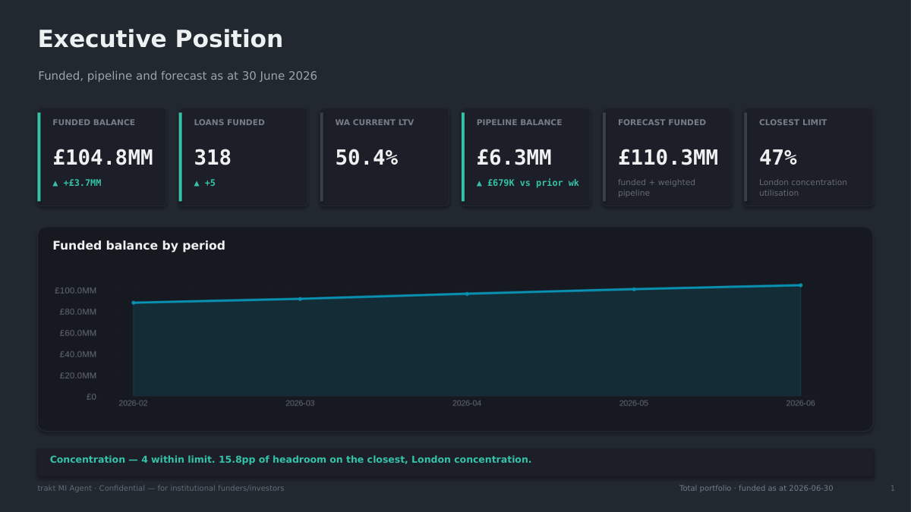
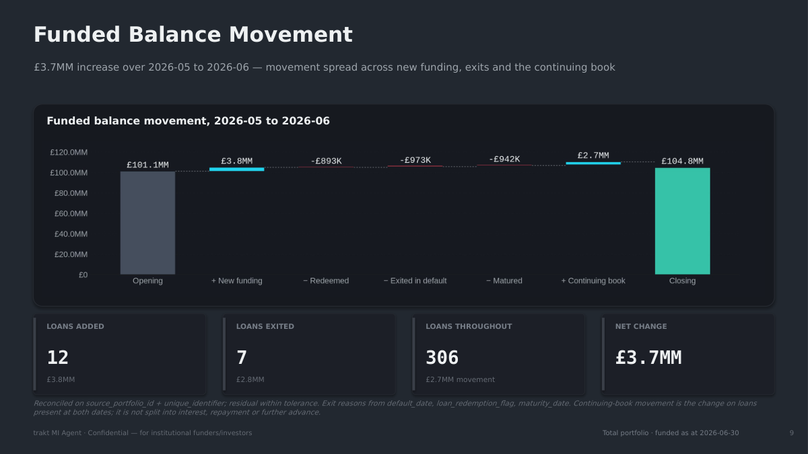
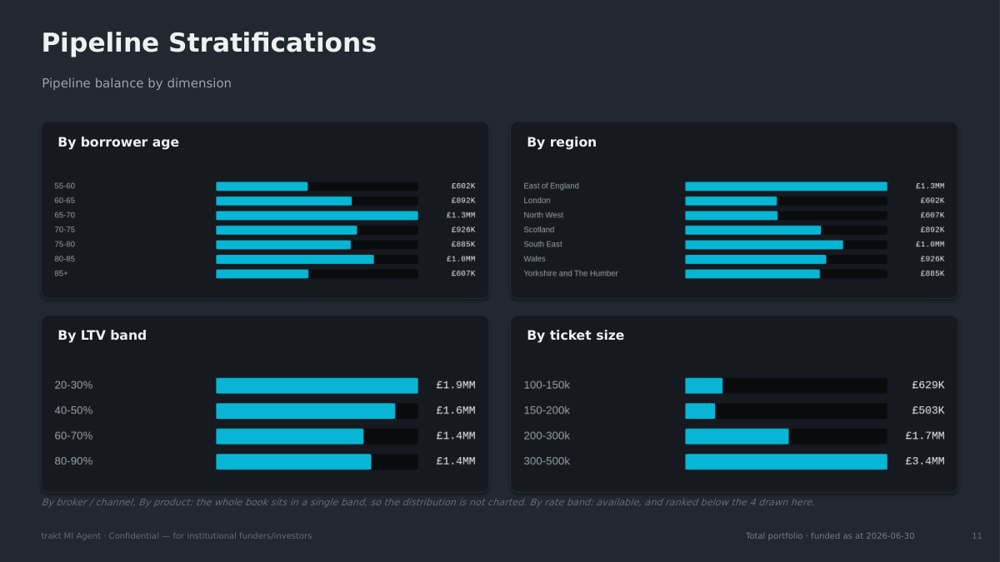
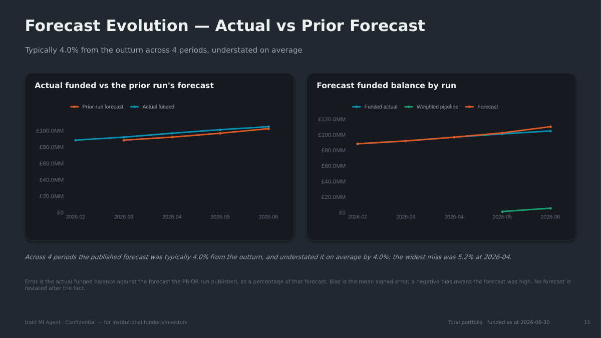
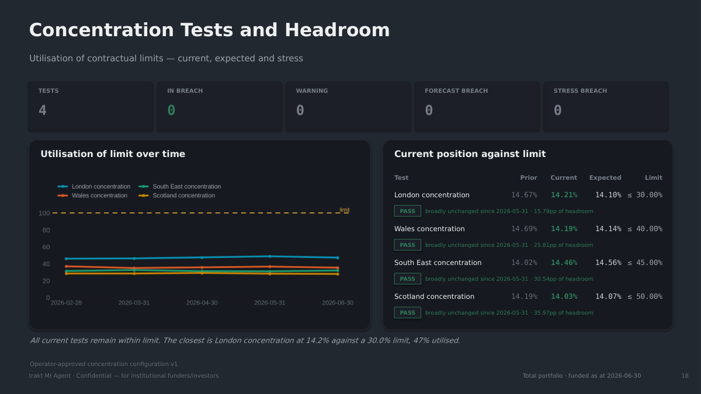

---

## 7. Verification

- **Real route:** all five representative books generated through
  `POST /mi/decks/generate` → poll → `GET /mi/decks/download`; 101 pages rasterised and
  inspected. QA harness findings: **0** on every variant (main: a foreign-currency defect
  on the EUR book).
- **Slide counts unchanged** (19 / 22 / 22 / 22 / 16) — composition was deliberately not
  touched.
- **Targeted suites:** every deck, deck-generation, insight-engine and currency test —
  broad regression below.
- **Broad regression** — the whole `tests/` tree run on unmodified main (`99b46ebc`) and on
  this branch, in shards, failure IDs diffed:

  | | main | this branch |
  |---|---|---|
  | passed | 9,703 | 9,771 (+68 = the new tests) |
  | failed | 112 | 112 — the identical set |

  One extra failure appeared once on this branch
  (`test_occ_day1_hardening::TestRestartAfterInterruption::test_the_operator_can_restart_and_gets_the_same_output`):
  a threaded wait-for-status test run while both trees' suites shared four cores. It
  passes alone on this branch, and nothing on the OCC path reads the fields this change
  adds. The 112 shared failures are all on main today and none touches the deck.
- **One regression caught during visual QA and fixed:** the new dark cards swallowed the
  waterfall opening bar (drawn in a surface colour); it now uses `navy-500`.

---

## 8. What is still open

1. **The unmerged capability work is now ported** (§6). The old branch can be retired once
   this one merges.
2. **Pack length** — addressed by the ported composition (§6): pages appear when the book
   supports them, and dimensions are chosen by information.
3. **Dated copies are write-once** — governance decision (§6).
4. **Deployment** — `deploy-mi-api.yml` is `workflow_dispatch` only. Nothing here reaches
   the App Service until it is run; the publish fix in particular only helps once deployed.
5. **Pre-existing on main, not touched:**
   `test_currency_authority::test_client_1_gbp_comes_from_the_governed_client_configuration`
   fails identically on unmodified main.
